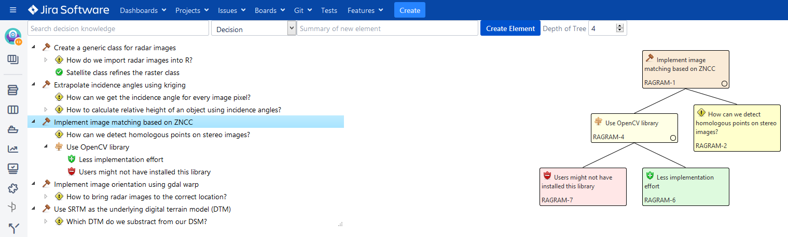
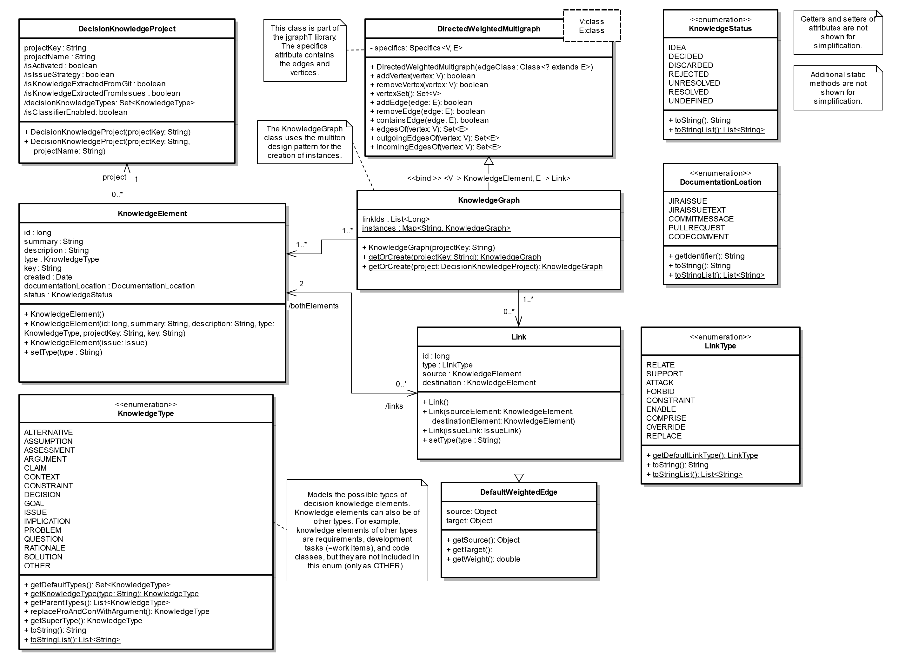
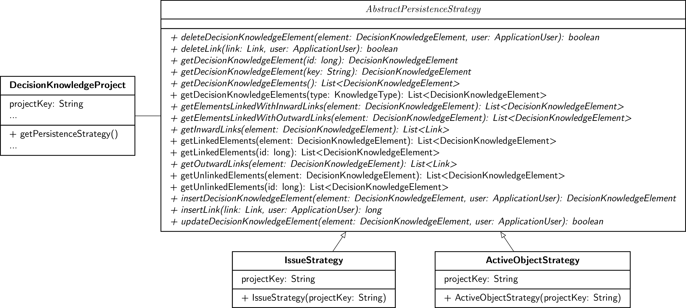

# cures-condec-jira

[](https://github.com/cures-hub/cures-condec-jira/actions/workflows/maven.yml)
[](https://www.codacy.com/gh/cures-hub/cures-condec-jira/dashboard?utm_source=github.com&amp;utm_medium=referral&amp;utm_content=cures-hub/cures-condec-jira&amp;utm_campaign=Badge_Grade)
[](https://codecov.io/gh/cures-hub/cures-condec-jira/branch/master)
[](https://github.com/cures-hub/cures-condec-jira/graphs/contributors)

The ConDec Jira plug-in enables the user to capture and explore decision knowledge in [Jira](https://de.atlassian.com/software/jira).
Decision knowledge covers knowledge about decisions, the problems they address, solution proposals, their context, and justifications (rationale). The documented decision knowledge can be linked to Jira issues such as features, tasks to implement a feature, or bug reports.
The plug-in supports four documentation locations for decision knowledge: entire Jira issues with distinct types, comments and the description of existing Jira issues, commit messages, and code comments.

## Installation

### Prerequisites
The following prerequisites are necessary to compile the plug-in from source code:
- Java 11 JDK
- [Atlassian SDK](https://developer.atlassian.com/docs/getting-started/set-up-the-atlassian-plugin-sdk-and-build-a-project)

### Compilation via Terminal
The source code is compiled via terminal.
Navigate into the cures-condec-jira folder and run the following command:
```
atlas-package
```
(Run `atlas-package -DskipTests=true` to skip unit tests to speed-up compilation.)
The .jar file is created.

Run the plug-in locally via:
```
atlas-run
```

### Download of Precompiled .jar-File
The precompiled .jar-File for the latest release can be found here: https://github.com/cures-hub/cures-condec-jira/releases/latest

### Installation in Jira
[The ConDec Jira plug-in is available via the Atlassian Marketplace.](
https://marketplace.atlassian.com/apps/1219690/decision-documentation-and-exploration)

Alternatively, the plug-in can be installed via uploading the .jar file to your Jira application:
- As a system administrator, navigate to Jira's administration console and click the "Add-ons" tab.
- Select "Manage add-ons" on the side-bar.
- Click on "Upload add-on" and select the previously compiled .jar file.
- Click "Upload" for upload and installation.
- [Activate the "Decision Documentation and Exploration" plug-in.](doc/screenshots/installed_plugin.png)
- Activate the plug-in for the specific project in the [setting page.](doc/screenshots/config_plugin.png)

## ConDec Views and Features

### Decision Knowledge Page
Jira ConDec provides a *TreeViewer* that lists all documented knowledge elements.
The user can choose the type of the top level knowledge element, e.g., to understand which decisions were made or which issues (decision problems) were addressed during the project.
The TreeViewer was implemented using the [jsTree jQuery plug-in](https://www.jstree.com).
Decision knowledge elements can be selected and the related elements can be viewed and selected as well.


*TreeViewer (left) and tree view of a single decision (right)*

The *Tree* view enables the user to explore decision knowledge related to the selected decision knowledge element.
The tree view was implemented using the [Treant.js library](http://fperucic.github.io/treant-js).

The user can [filter the decision knowledge](doc/screenshots/example_radargrammetry_filter.png) and manage it using drag and drop and a [context menu](https://github.com/cures-hub/cures-condec-jira/raw/master/doc/screenshots/example_radargrammetry_context_menu.png).

### Jira Issue Module
Jira ConDec provides a [Jira issue module that enables the user to explore decision knowledge related to Jira issues such as feature tasks](https://github.com/cures-hub/cures-condec-jira/raw/master/doc/screenshots/example_radargrammetry_issue_module.png).

### Configuration
The [project setting page](doc/screenshots/config_plugin.png) enables the user to:
- Activate the plug-in for the specific project.
- Choose the persistence strategy (either *issue strategy* or *active object strategy*). If you choose the issue strategy, you need to associate the project with the *decision knowledge issue type scheme*.
- Configure the features listed below

### Features
ConDec offers the following features:
- [Decision knowledge documentation in various documentation locations](doc/features/documentation.md)
- [Extraction and presentation of knowledge in git](doc/features/knowledge-in-git-presentation.md)
- Knowledge graph creation comprising requirements, decision knowledge, code files, and other software artifacts
- [Interactive knowledge visualization](doc/features/knowledge-visualization.md)
- [Change impact analysis](doc/features/change-impact-analysis.md)
- [Definition of done checking to support high quality of the knowledge documentation](doc/features/quality-checking.md)
- [Automatic text classification to identify decision knowledge in natural language text](doc/features/automatic-text-classification.md)
- [Recommendation of solution options from external knowledge sources](doc/features/decision-guidance.md)
- [Link recommendation and duplicate recognition](doc/features/link-recommendation.md)
- [Nudges for decision knowledge documentation and exploitation](doc/features/nudging.md)
- [Decision grouping](doc/features/decision-grouping.md)
- [Creation of release notes with explicit decision knowledge](doc/features/release-notes-creation.md)
- [Metrics presentation in a knowledge dashboard](doc/features/dashboard.md)
- [Webhook to inform a receiver system about changed knowledge](doc/features/webhook.md)

## Implementation Details

### Model
The [model interfaces and classes](src/main/java/de/uhd/ifi/se/decision/management/jira/model) are used to represent decision knowledge in Jira.


*Model interfaces and classes*

### Persistence Strategies
The Jira ConDec plug-in supports two strategies to [persist decision knowledge in Jira](src/main/java/de/uhd/ifi/se/decision/management/jira/persistence): the *issue strategy* and the *active object strategy*.


*Persistence strategies*

The issue strategy represents decision knowledge elements as Jira issues.
Jira issue links are used to link decision knowledge elements to each other and to Jira issues of other types such as feature tasks.
The advantage of this strategy is that all features available for Jira issues can be used to manage decision knowledge, e.g., searching for a decision in the list of issues.
The disadvantage is that the dedicated issue type scheme needs to be assigned to the Jira project.
To overcome this disadvantage, the active object strategy uses distinct model classes for decision knowledge elements and their links.
This strategy uses object-relational mapping to communicate with Jira's internal database.

### REST API
This plug-in provides a [representational state transfer (REST) application programming interface (API)](src/main/java/de/uhd/ifi/se/decision/management/jira/rest), 
e.g., to retrieve, insert, update, and delete decision knowledge in Jira.
These services can be accessed via the following link:

**Jira base URL**/rest/condec/latest/**knowledge|config|view|dashboard|grouping|dodchecking|git|decision-guidance|linkrecommendation|nudging|classification|releasenotes|webhook**/**REST service**

The Jira ConDec plug-in uses the REST services in the [REST Java Script client](src/main/resources/js/condec.api.js) from the user interface.

### Logging and Monitoring
The backend (Java) code of the plug-in contains `LOGGER.info()` statements that can be used to monitor the plug-in usage, 
e.g. to evaluate which views the users prefer.
You need to configure the `log4j.properties` so that `LOGGER.info()` statements are logged.
More infos on usage data analysis can be found [here](doc/logging/).