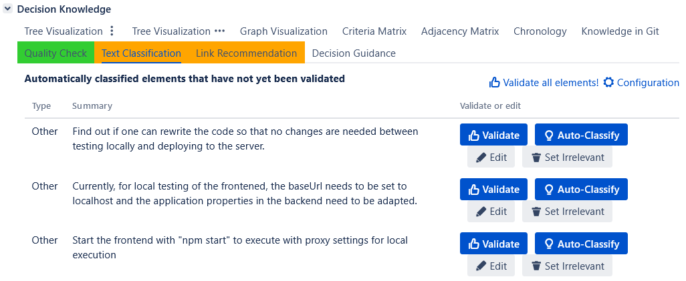

# Automatic Text Classification/Rationale Identification

The ConDec Jira plug-in offers a feature that **automatically classifies text** either as relevant decision knowledge elements or as irrelevant.
The text classifier consists of a **binary** and a **fine-grained classifier**.

## Ground Truth Data
Ground truth data is needed to train and evaluate the text classifier.
ConDec installs two default training files: [one rather small one](../../src/main/resources/classifier/defaultTrainingData.csv) and one with the data used for the NLP4RE'21 paper.

To reproduce the results from the [**NLP4RE'21 paper**](http://ceur-ws.org/Vol-2857/nlp4re1.pdf) do the following steps:
- Install the [version 2.3.2](https://github.com/cures-hub/cures-condec-jira/releases/tag/v2.3.2) of the ConDec Jira plug-in and activate the plug-in for a Jira project.
- Navigate to the text classification settings page (see section below).
- Choose the training file [CONDEC-NLP4RE2021.csv](../../src/main/resources/classifier/CONDEC-NLP4RE2021.csv).
- Set the machine-learning algorithm to Logistic Regression for both the binary and fine-grained classifiers.
- Run 10-fold cross-validation (you need to set k to 10).
- ConDec writes evaluation results to a text file. 
The output file will be similar to [evaluation-results-CONDEC-NLP4RE2021-LR-10fold](evaluation-results-CONDEC-NLP4RE2021-LR-10fold.txt). 
The results might differ a little bit because of the random undersampling that we did to balance the training data.

Basic descriptive statistics on ground truth files can be calculated using the R file [training-data-analysis.r](training-data-analysis.r).

## Usage During Development
The classifier predicts whether the textual parts in the Jira issue description, comments, or commit messages are relevant decision knowledge elements and, 
if yes, it annotates the parts accordingly.
ConDec performs the **automatic annotation** directly **in the text of the Jira issue description and comments** when developers save textual changes.
Besides, ConDec offers a dedicated **view for text classification**.
In the text classification view, developers **manually approve the classification result**, i.e., 
developers decide whether the annotations are correct or not.
Developers can trigger the automatic text classification using the *Auto-Classify* button.

*Text classification view with three sentences not yet manually approved/validated*

## Activation and Configuration
The text classifier can be trained and evaluated directly in Jira.

*Configuration view for the automatic text classifier*

## Design Details
The following class diagram gives an overview of relevant backend classes for this feature.
The class *TextClassifier* is responsible for processing the text of the description and comments of a Jira issue. 
It uses a classifier type, ground-truth data, as well as some configuration information in order to classify the text. 
The *ClassificationManagerForJiraIssueText* calls the TextClassifier to classify the text. 
The *JiraTextExtractionEventListener* is used for online learning, so that the classifier can learn while in use. 
Developers manually approve classifications by setting them as "validated". 
Any time a validated element is added, the classifier learns.

*Overview class diagram for the automatic text classification*

The Java code for the automatic text classification can be found here:

- [Java code for automatic text classification](../../src/main/java/de/uhd/ifi/se/decision/management/jira/classification)
- [Java REST API for decision guidance](../../src/main/java/de/uhd/ifi/se/decision/management/jira/rest/TextClassificationRest.java)

The UI code for the automatic text classification can be found here:

- [Velocity templates for configuration and evaluation](../../src/main/resources/templates/settings/classification)
- [Velocity template for text classification view](../../src/main/resources/templates/tabs/textClassification.vm)
- [JavaScript code for text classification](../../src/main/resources/js/classification)

# Important Decisions
In the following, important decision knowledge regarding the automatic text classification feature is listed.
The knowledge was exported via [ConDec's knowledge export feature](knowledge-export.md) starting from the 
user sub-tasks *ST: Continuously document decision knowledge in Jira*, *ST: Set up rationale management process*, and 
*ST: Evaluate the performance of algorithms and "smart features"*.
Decision knowledge elements that belong to the decision group *text classification* and 
that are directly and indirectly (transitively) linked to the sub-tasks are shown.

- ST: Continuously document decision knowledge in Jira ([CONDEC-188](https://jira-se.ifi.uni-heidelberg.de/browse/CONDEC-188))
	-  How to manually classify text as an decision knowledge element?
		-  Annotate/tag text with Jira macros or icons/emojis to classify it as an decision knowledge element! Automatically replace icons with macro tags, e.g. "\(!\) How to...?" is replaced with "\ How to...? \"!
	-  How to enable the user to manually classify parts/sentences of Jira issue comments and description into the knowledge types activated for the project?
		-  We enable the user to manually classify parts/sentences of Jira issue comments and description using annotations/tags!
	-  How can we update knowledge elements from Jira issue text after the text was edited by the user?
		-  We catch the comment edited and Jira issue updated events via an event listener to update knowledge elements from Jira issue text after the text was edited by the user!
	-  How can we get the part of text from database while creating a colored decision knowledge macro in Jira issue text?
		-  We get all parts of text of the current Jira issue, filter them for the current macro type, and select them by text body to get the part of text from database while creating a colored decision knowledge macro in Jira issue text!
			-  this approach is slow for larger comment sections
			-  If a text does not match, no context menu can be provided
			-  Enables to add the context menu on parts of text in Jira issue description/comments.
	-  Which decision knowledge types do we enable for manual annotation in Jira issue text?
		-  We enable only five decision knowledge types for manual annotation in Jira issue text: issue, decision, alternative, pro, and con!
			-  Only a subset of elements in the DDM
			-  Most common types
		-  We could try to enable all activated decision knowledge types for manual annotation in Jira issue text.
			-  A lot of macro classes and entries in atlassian-plugin.xml would be needed.
	-  How to identify invalid parts of text in database?
		-  Set elements with an empty summary and decription as invalid!
	-  How to deal with an updated Jira issue description or comment?
		-  Update the existing elements in database if the number of total elements does not decrease!
			-  If a new element is added in between, e.g. a new argument, the links are wrong.
		-  Update the existing elements in database if the number of total elements stays the same!
			-  Keeps the existing links
		-  Reread decision knowledge elements from Jira issue description or comment if the user added a new element or deleted an existing element in the text!
	-  How should we deal with Jira issue text annotated with decision knowledge tags that includes text formatting, inner macros, images and so on?
		-  Render text formatting, inner macros, images and so on in knowledge classification macros!
			-  The content in the description or comment of a Jira issue looks different to the graph node.
			-  After rendering, it is not clear whether the inner macro is part of the knowledge element.
		-  Do not render text formatting, inner macros, images and so on in knowledge classification macros, only render line breaks!
			-  A knowledge element should be formulated in a short easy way so that it is easy to understand without cluttering through images, macros and so on. All other information is context information, which a developer can read from the text.
			-  Is consistent with the graph/tree nodes because there is also nothing rendered.
			-  Popular Jira macros such as code also do not render inner macros.
	-  Where do we show a tree viewer/indented outline with decision knowledge extracted from Jira issue text?
		-  We could try to clone the comment section.
			-  It is not clear whether and how this would work.
		-  We decided to include the tree viewer/indented outline in the Jira issue module!
			-  All the ConDec views are in the same place.
		-  rejected: We used to show the tree viewer/indented outline in a separate ConDec tab panel.
		-  rejected: We used to show the tree viewer/indented outline in a separate dialog.
	-  How can we remove the icon's textual representation from Treant nodes?
		-  We decided to automatically parse an icon into a knowledge type macro when the user saves the Jira issue comment/description!
		-  rejected: We used a regex to remove the icons' textual representation from nodes in the knowledge views!
	-  Which libraries should we use for automatic text classification?
		-  Remove weka and meka dependencies because it is not needed anymore, we do text classification with smile (Statistical Machine Intelligence and Learning Engine)!
	-  How should we indicate that an automatic classified part of text needs manual approval?
		-  I renamed the isTagged column to isValidated.
	-  Should we integrate parts of Jira issue description and comments into one database and model class or separate them?
		-  Only use one model class, database table, and persistence manager for both decision knowledge elements in Jira issue description and comments!
			-  How can we distinguish between decision knowledge elements in the description of a Jira issue from those in comments in the database table?
			-  No redundant code
	-  How can we avoid that the parenthesis of the knowledge type macro is escaped in text mode?
		-  Add a line break in front of the parenthesis!
	-  How do we determine whether a part of text needs to be classified as relevant or irrelevant wrt. decision knowledge?
		-  We use the attribute "isRelevant" to determine hether a part of text needs to be classified as relevant or irrelevant wrt. decision knowledge!
		-  rejected: The Sentence class (later PartOfJiraIssueText) gets an attribute "isPlainText". This allows to distinguish between plain text and other, like quotes, code, noformat (log files,..), etc. If isPlainText is set to false, these sentence instances will not be passed to the classification functions or labeled on the UI.
	-  How can the system distinguish between a plain text comment and a special formatted comment?
		-  We set special formatted text (e.g. code snippets) to isRelevant=false so that we know that they do not need to be classified!
		-  rejected: We add a boolean attribute isPlainText to distinguish between a plain text and a special formatted comment!
			-  Not really necessary because we have the "isRelevant" attribute.
	-  What behavior do we expect when changing the type of decision knowledge in Jira issue text?
		-  Changing the type of manually classified sentences in Jira issue text (comments and description) should change their tags as well!
	-  How can we build a view for the extracted decision knowledge from Jira issue text (DecXtract)?
		-  We removed the separate tab panel (for DecXtract) and integrated all ConDec views of a Jira issue into one Jira issue module!
			-  All ConDec views are in one place.
		-  rejected: We used to add a new tab panel in the Jira issue view for DecXtract! This tab panel was located next to the comment panel!
	-  Should we do default options/opt-out nudging for the automatic text classifier?
		-  The automatic text classifier should be trained and enabled by default when the plugin is activated for a project!
			-  The text classifier requires a lot of computational resources, to use it without a real need is not sustainable.
		-  We decided not to do this now, as the classifier's results are not reliable enough to make it useful!
	-  Where should the information about automated text classifications be displayed?
		-  Display information about text classifications in a tab combined with information about other smart features!
			-  This would be hard to use.
		-  Display information about the automated text classifications in a just-in-time prompt!
		-  Display information about the automated text classifications in a new tab!
	-  Should we add macro tags when automatically classifying issue comments?
		-  Macro tags are added when automatically classifying issue comments!
			-  The TAGGED_MANUALLY cell is always set to true no matter whether the comment was classified automatically or manually.
		-  Remove column TAGGED_MANUALLY from CONDEC_IN_COMMENT table!
			-  We already have the "is validated" attribute to store the information whether decision knowledge is manually approved or not.
	-  Which information about the automated text classifications should be displayed?
		-  Display only the elements that were classified and not yet validated!
		-  Display all elements that were classified!
	-  Which attributes should we store for a part of Jira issue text (which can be relevant wrt. decision knowledge or irrelevant)?
		-  rejected: We renamed START_SUBSTRING_COUNT to START_POSITION and END_SUBSTRING_COUNT to END_POSITION as attributes to store a part of Jira issue text!
		-  rejected: I removed the TAGGED_MANUALLY column since it is currently always set to true because of the added macro tags!
		-  rejected: I deleted the ARGUMENT and the USER_ID column (as former attributes to store a part of Jira issue text)!
		-  I made isTaggedFineGrained a derived method that returns true if the knowledge type is not OTHER.
		-  rejected: I renamed the column KNOWLEDGE_TYPE_AS_STRING into TYPE in order to use the same terminology as in the CONDEC_ELEMENT table (as attributes to store a part of Jira issue text)!
		-  We store the following attributes for a part of Jira issue text: id, comment id (0 means documented in description), start and end position in the text, project key of the Jira project, whether it is validated (manually approved), knowledge type, and status!
	-  How can new comments automatically be linked to other decision knowledge?
		-  Link new comments automatically to decision knowledge by rules!
	-  What should be presented in the Jira issue tab panel for decision knowledge? ([CONDEC-401](https://jira-se.ifi.uni-heidelberg.de/browse/CONDEC-401))
		-  We decided to remove the tab panel and add a tab in the ConDec Jira issue module instead!
			-  All the ConDec views are in one place.
		-  rejected: We used to show representations with tags, e.g. [issue] ... [/issue]!
			-  Used to be like this, but is now inconsistent with comments tab panel
		-  We use icons and colors to indicate decision knowledge!
			-  Consistent with comments tab.
		-  rejected: We used to show a tree viewer in tab panel for decision knowledge!
		-  discarded: We could show the same text as in the comment tab panel!
			-  Would enable to add smart functionality such as drag&drop, i.e. would be better extensible than normal comment tab panel.
			-  This would be redundant to the comment tab panel
	-  How to deal with irrelevant parts of Jira issue text in knowledge graph? ([CONDEC-362](https://jira-se.ifi.uni-heidelberg.de/browse/CONDEC-362))
		-  rejected: We used to include only relevant parts of text (=decision knowledge elements) into knowledge graph! ([CONDEC-365](https://jira-se.ifi.uni-heidelberg.de/browse/CONDEC-365))
			-  Aligned with domain model that graph is a graph of decision knowledge (=only relevant sentences)
		-  Include irrelevant parts of text into knowledge graph! ([CONDEC-363](https://jira-se.ifi.uni-heidelberg.de/browse/CONDEC-363))
			-  Needs special treatment to only get relevant decision knowledge.
		-  Add parameter to Graph constructor to specify whether irrelevant sentences should be included! ([CONDEC-367](https://jira-se.ifi.uni-heidelberg.de/browse/CONDEC-367))
		-  We decided to add irrelevant parts of text/sentences to the knowledge graph and filter them out per default!
	-  How can we classify text as decision knowledge (or as irrelevant wrt. decision knowledge)?
		-  We use and adopt the classification methods and training data by R. Alkadhi to classify text as decision knowledge (or as irrelevant wrt. decision knowledge)!
	-  Which classifier algorithm to choose for automatic text classification?
		-  We could use the binary relevance or Labor Powerset as base Classifier.
			-  model file is ~30 MB / 20 MB larger than with Labor Powerset
			-  only one class per sentence possible
			-  Better precision for new sentences
		-  rejected: We used the Classifier Chains as meka base classifier!
		-  We replaced WEKA/MEKA with the SMILE library and now enable the rationale manager to choose a classifier algorithm!

- ST: Set up rationale management process ([CONDEC-179](https://jira-se.ifi.uni-heidelberg.de/browse/CONDEC-179))
	-  When should the automatic text classifier be enabled?
		-  The automatic text classifier should be enabled by default, as an opt-out nudge!
			-  This would use a lot of computing power, as all text in the project is classified when the classifier is activated
			-  The developers would not need to classify the text manually (even if the rationale manager did not actively activate the text classifier).
			-  The quality of the text classifications is not high enough for this to be useful.
		-  The automatic text classifier should not be enabled by default!
			-  We could avoid unnecessarily using computing resources by leaving the automatic text classifier as an opt-in feature, would be better for sustainable development.
	-  How can we enable the rationale manager to decide whether automatic classification should be enabled?
		-  We added a toggle in the project settings to allow the rationale manager to turn automatic classification on and off!
	-  How can the rationale manager decide s/he wants to use the extraction of decision knowledge elements from Jira issue description and comments (=DecXtract) or not?
		-  rejected: There used to be a toggle on the project settings page to enable/disabled the extraction of decision knowledge elements from Jira issue description and comments (DecXtract)!
		-  Make the extraction of decision knowledge elements from Jira issue description and comments (DecXtract) a default feature of ConDec! It cannot be disabled by the user!
	-  Should we do default options/opt-out nudging for the automatic text classifier?
		-  The automatic text classifier should be trained and enabled by default when the plugin is activated for a project!
			-  The text classifier requires a lot of computational resources, to use it without a real need is not sustainable.
		-  We decided not to do this now, as the classifier's results are not reliable enough to make it useful!
	-  Should only user-validated data be exported?
		-  We enabled the rationale manager to export user-validated/manual approved parts of text (decision knowledge elements and irrelevant parts)!
			-  The main problem is that users dont seem to validate non-relevant text wich leads to a very imbalanced dataset.

- ST: Evaluate the performance of algorithms and "smart features" ([CONDEC-681](https://jira-se.ifi.uni-heidelberg.de/browse/CONDEC-681))
	-  How can the ground truth data for the text classifier be balanced so that it is not biased towards one (or more) classes?
		-  Balance ground truth data for the binary and fine-grained classifiers using random undersampling, split lists of knowledge elements for k-fold cross-validation in such a way that the knowledge type is equally distributed!
		-  Use synthetic minority oversampling technique to balance the ground truth data!
	-  How can a researcher/data scientist evaluate the performance of the automatic text classification?
		-  Add two evaluation sections in classifier settings: one for cross-project validation and one for k-fold cross-validation!
	-  How can we make the evaluation results of the automatic text classification accessible?
		-  Store last evaluation results of the automatic text classification for a project and show it in the configuration/settings view!
		-  Enable to store evaluation result in file system as a text file (in JSON format)!

## Publication
Kleebaum, A., Paech, B., Johanssen, J. O., & Bruegge, B. (2021). 
Continuous Rationale Identification in Issue Tracking and Version Control Systems. 
In REFSQ-2021 Workshops, OpenRE, Posters and Tools Track, and Doctoral Symposium (p. 9). 
Essen/Virtual: CEUR-WS.org. https://doi.org/10.11588/heidok.00029966