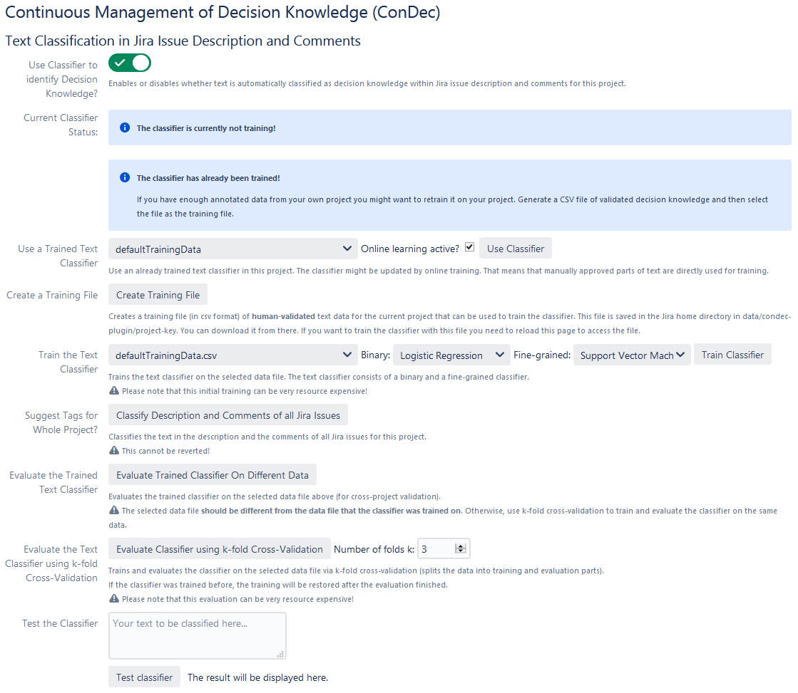

# Automatic Text Classification/Rationale Identification

The ConDec Jira plug-in offers a feature that automatically classifies text either as relevant decision knowledge elements or as irrelevant.
The text classifier consists of a binary and a fine-grained classifier.

## Ground Truth Data
Ground truth data is needed to train and evaluate the text classifier.
ConDec installs two default training files: [one rather small one](../../src/main/resources/classifier/defaultTrainingData.csv) and one with the data used for the NLP4RE'21 paper.

To reproduce the results from the [**NLP4RE'21 paper**](http://ceur-ws.org/Vol-2857/nlp4re1.pdf) do the following steps:
- Install the [version 2.3.2](https://github.com/cures-hub/cures-condec-jira/releases/tag/v2.3.2) of the ConDec Jira plug-in and activate the plug-in for a Jira project.
- Navigate to the text classification settings page (see section below).
- Choose the training file [CONDEC-NLP4RE2021.csv](../../src/main/resources/classifier/CONDEC-NLP4RE2021.csv).
- Set the machine-learning algorithm to Logistic Regression for both the binary and fine-grained classifiers.
- Run 10-fold cross-validation (you need to set k to 10).
- ConDec writes evaluation results to a text file. The output file should be similar to [evaluation-results-CONDEC-NLP4RE2021-LR-10fold](evaluation-results-CONDEC-NLP4RE2021-LR-10fold.txt). The results might differ a little bit because of the random undersampling that we did to balance the training data.

Basic descriptive statistics on ground truth files can be calculated using the R file [training-data-analysis.r](training-data-analysis.r).

## Activation and Configuration
The text classifier can be trained and evaluated directly in Jira.

*Configuration view for the automatic text classifier*