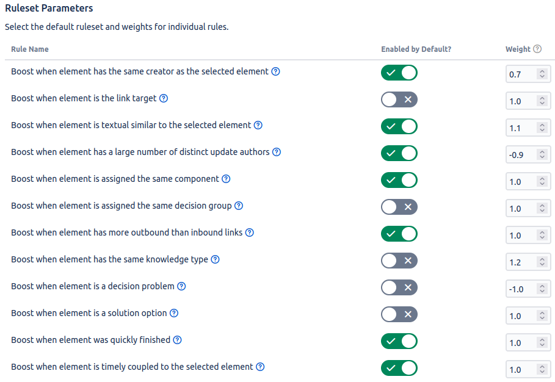

# Change Impact Analysis

Developers can exploit the knowledge documentation during changes, to estimate change impacts.
The [node-link diagram, tree, list, and matrix views](knowledge-visualization.md) can be used for **change impact analysis (CIA)**.
ConDec colors the knowledge elements in these views according to the likelihood that they are affected by a change in the selected element.
The [knowledge graph visualization](knowledge-visualization.md) and change impact analysis should support the developers to make new decisions consistent with the requirements and former decisions.


*Node-link diagram with change impact highlighting. 
Decision problems (issues), solution options (decisions and alternatives), requirements, and code files are shown that might be impacted by a change in the epic. 
The color indicates the likelihood of change impacts: 
red elements are probably more impacted by a change than green elements.*

## Calculation of the Estimated Impact Set (EIS)

During change impact analysis, each knowledge element (i.e. node/vertex) in the knowledge graph is given an **impact value** (i.e. impact factor). If [new links are being recommended](link-recommendation.md), developers can choose to also include these new elements in the CIA calculation.
High impact values indicate that the element is highly affected by the change and needs to be changed as well. 
The impact value of an element (`elementImpact`) is calculated using the following equation:

```
elementImpact = parentImpact * (1 - decayValue) * linkTypeWeight * ruleBasedValue * recommendationScore
```

where `parentImpact` is the element impact of the ancestor node in the knowledge graph, 
`decayValue` is the decay per iteration step, `linkTypeWeight` is a link type specific decay value between 0 and 1 of the traversed edge between the parent/ancestor element and the current element, 
`ruleBasedValue` is the normalized sum of all selected rule values, and `recommendationScore` is the link recommendation score of the current element, if the element was recommended.
The following rules are available:

1. Outward links only
2. Boost when element has the same creator as the selected element
3. Boost when element is textual similar to the selected element
4. Boost when element is assigned to the same component
5. Boost when element is assigned to the same decision group
6. Boost when element has a low average age
7. Boost when element has more outbound than inbound links 
8. Boost when element has a large amount of distinct update authors
9. Boost when element received updates in the same timeframe (i.e. is timely coupled)
10. Boost when element has the same knowledge type
11. Boost when element is a decision problem
12. Boost when element is a solution option

The element is included in the **estimated impact set (EIS)** if `elementImpact >= threshold`.
Developers can see an **explanation for the impact factor** of each node via a tooltip.


*JSTree diagram with change impact hightlighting*

## Configuration
The rationale manager can set the default parameters for the change impact analysis, e.g. the decay value, threshold and default ruleset. In addition, they can set a weight value for each rule. A high weight value indicates a rule being more important than usual and increases the impact of that rule accordingly.
Furthermore, the developer can change the default values during the usage of change impact analysis. If [new links are being recommended](link-recommendation.md), developers can further adjust whether recommendations are being included in CIA.



*Change impact analysis configuration page*

## Design Details
The following class diagram gives an overview of relevant backend classes for the change impact analysis.

The class `ChangeImpactAnalysisRest` provides the interface to the frontend. 
`ChangeImpactAnalysisService` serves as the main hub that connects all relevant CIA classes.
To achieve CIA, `Calculator` is called first. This class calculates the change impact of each element and uses `KnowledgeElementWithImpact` to store the result.

It uses the `ChangeImpactAnalysisConfig` to get the configuration information for a project when a request is received. The configuration includes weight value, decay, threshold and a list of `ChangePropagationRule`. Each rule stores an enum `ChangePropagationRuleType` and the corresponding weight value. Each of these enums has a distinct `ChangePropagationFunction` that is implemented by twelve available classes:

1. `IgnoreIncomingLinks`, implements a function that defines that a change impact is not propagated along an incoming link to an element.
2. `BoostIfTextualSimilar`, implements a function that defines that a change impact is stronger propagated if the traversed element in the knowledge graph is similar to the selected element.
3. `BoostWhenEqualComponent`, implements a function that defines that a change impact is stronger propagated if the traversed element in the knowledge graph is assigned to the same component.
4. `BoostWhenEqualDecisionGroup`, implements a function that defines that a change impact is stronger propagated if the traversed element in the knowledge graph is assigned to the same decision group.
5. `BoostWhenMoreOutboundLinks`, implements a function that defines that a change impact is stronger propagated if the traversed element in the knowledge graph has more outbound elements than inbound elements.
6. `BoostWhenLowAverageAge`, implements a function that defines that a change impact is stronger propagated if the traversed element in the knowledge graph has a low average age.
7. `BoostWhenHighAmountOfDistinctAuthors`, implements a function that defines that a change impact is stronger propagated if the traversed element in the knowledge graph has a large amount of distinct update authors.
8. `BoostWhenTimelyCoupled`, implements a function that defines that a change impact is stronger propagated if the traversed element in the knowledge graph is coupled with the source element, i.e. if both have received updates in the same timeframe.
9. `BoostWhenEqualCreator`, implements a function that defines that a change impact is stronger propagated if the traversed element in the knowledge graph has the same creator, reporter or assignee.
10. `BoostIfSolutionOption`, implements a function that defines that a change impact is stronger propagated if the traversed element in the knowledge graph is of type solution option.
11. `BoostIfDecisionProblem`, implements a function that defines that a change impact is stronger propagated if the traversed element in the knowledge graph is of type decision problem.
12. `BoostWhenEqualKnowledgeType`, implements a function that defines that a change impact is stronger propagated if the traversed element in the knowledge graph has the same type.

Once the calculation completes, either a `VisGraph`, `Matrix` or `TreeViewer` *view* object is created using the results. Then, `Colorizer` is called. This class utilizes the impact score to colorize each `VisNode`, `MatrixNode` or `TreeViewerNode` of the previously created object accordingly.
Once complete, `Tooltip` is called. This class utilizes all gathered information to generate and attach a distinct tooltip to each node. `ChangeImpactAnalysisService` then returns the *view* object, therefore concluding the CIA process.


*Overview class diagram for the change impact analysis*

The Java code for the change impact analysis can be found here:

- [Java code for the change impact analysis](../../src/main/java/de/uhd/ifi/se/decision/management/jira/changeimpactanalysis)
- [REST-API for the change impact analysis](../../src/main/java/de/uhd/ifi/se/decision/management/jira/rest/ChangeImpactAnalysisRest.java)

The UI code for the change impact analysis can be found here:

- [JavaScript code for the change impact analysis](../../src/main/resources/js/changeimpactanalysis)
- [Velocity template for the configuration](../../src/main/resources/templates/settings/changeImpactAnalysisSettings.vm)

## Important Decisions

The knowledge was exported via [ConDec's knowledge export feature](knowledge-export.md).

-  Which metrics/rules do we use for change impact analysis (CIA)?
	-  discarded: Number of past updates
		-  Is already included in a different metric
	-  If solution option
	-  If decision problem
	-  Ratio between outbound and inbound links
	-  Low average age
	-  Same decision group
	-  Same creator
	-  Same component
	-  Same knowledge type
	-  Textual similarity
	-  Number of distinct update authors
	-  Outbound links only
	-  discarded: Likelihood
		-  Time-consuming calculation due to iteration over all elements in a project