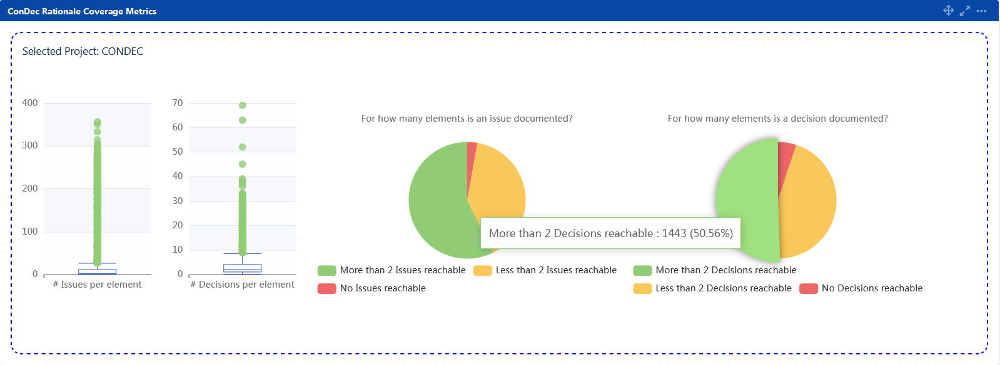
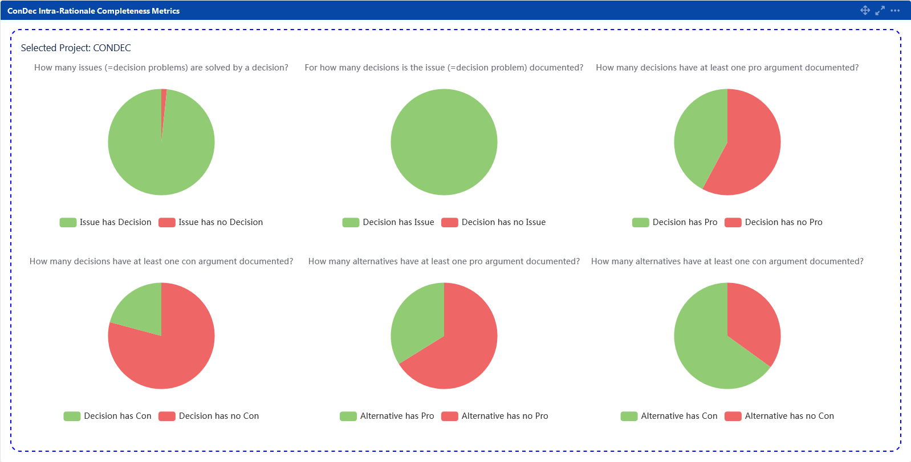
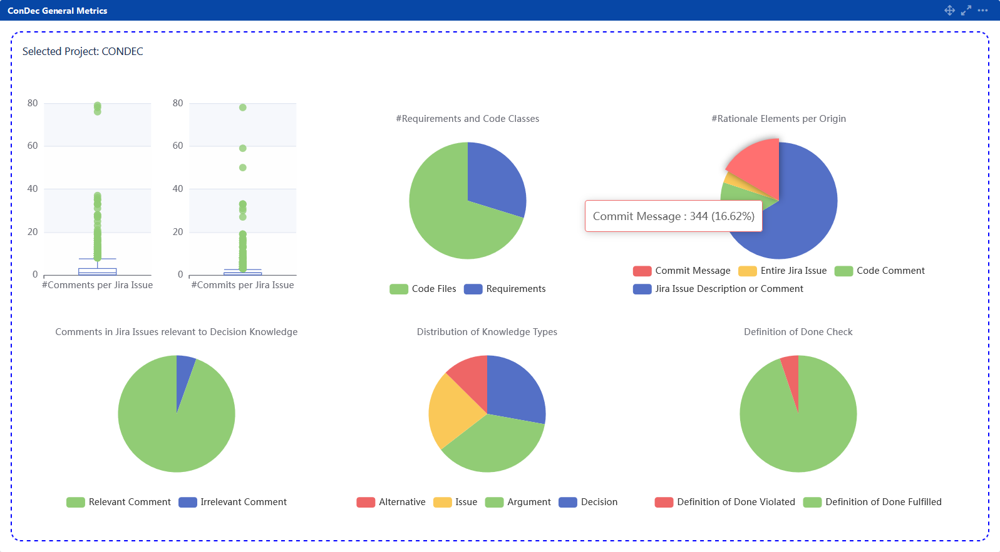
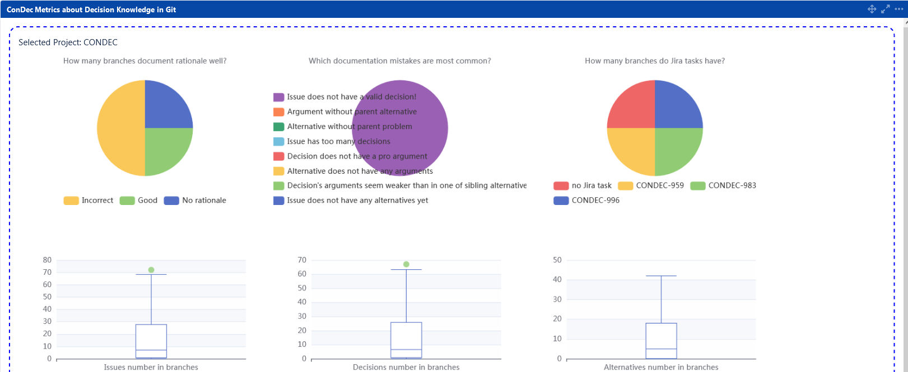
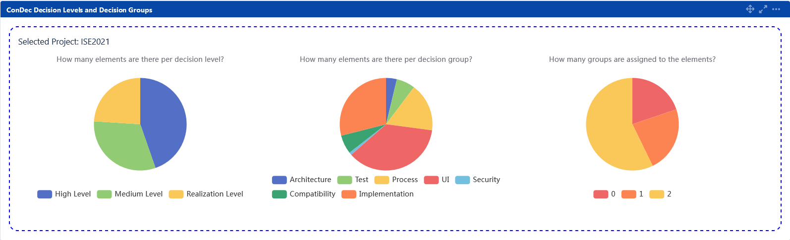
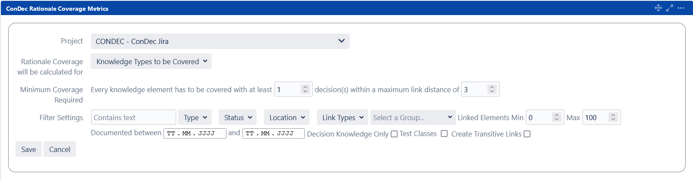
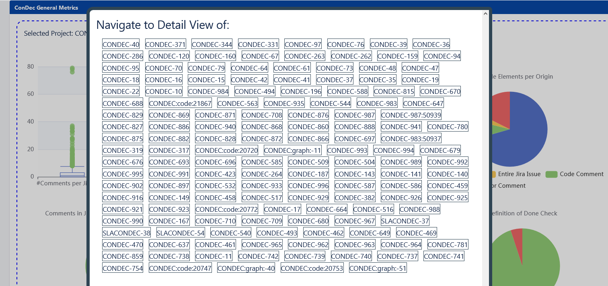
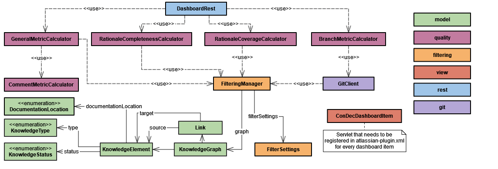

# Knowledge Dashboard

ConDec presents **metrics calculated on the knowledge graph data structure** in a knowledge dashboard.
The dashboard comprises five dashboard items that show the following metrics:

1. the **rationale coverage** of requirements and code, e.g., *how many decisions are documented for a requirement?*, 
2. **intra-rationale completeness**, e.g., *are there arguments for the decisions?*, 
3. **general metrics**, e.g., *how many rationale elements are documented per origin/documentation location?*, 
4. **metrics on the knowledge in git**, e.g., 
*do the rationale elements documented in [code comments and commit messages of a branch](knowledge-in-git-presentation.md) fulfill the [definition of done (DoD)](quality-checking.md)?*, and
5. **metrics on the decision levels and decision groups**, e.g. *Which decision groups are there in the project? How many decisions are documented per decision level and group?*

The metric plots are created using the [Apache ECharts library](https://echarts.apache.org).
The four dashboard items are shown in the following sections.

## Rationale Coverage
This dashboard item shows the **coverage of requirements, code, and other software artifacts (=knowledge elements) 
with a specific decision knowledge type, in particular, decision problem or decision**. 
For example, this dashboard item shows how many decisions are reachable from a requirement or 
how many decisions are reachable from a code file **within a certain link distance in the knowledge graph**.
Note that the rationale coverage is not calculated for rationale elements as source elements because there are 
dedicated metrics for intra-rationale completeness (see below).

*Rationale coverage dashboard item showing the **issue/decision problem coverage** and **decision coverage** using boxplots and pie charts*

## Intra-Rationale Completeness

This dashboard item presents **metrics regarding the intra-rationale completeness**.
In particular, metrics are shown to answer the following questions:
- How many **issues (=decision problems) are solved by a decision**? How many issues are not solved by a decision?
- For how many **decisions is the issue (=decision problem) documented**? For how many decisions is no issue documented?
- How many **decisions have at least one pro-argument** documented? How many decisions have no pro-arguments documented?
- How many **decisions have at least one con-argument** documented? How many decisions have no con-arguments documented?
- How many **alternatives have at least one pro-argument** documented? How many alternatives have no pro-arguments documented?
- How many **alternatives have at least one con-argument** documented? How many alternatives have no con-arguments documented?

*Intra-rationale completeness dashboard item showing the metrics using pie charts*

## General Metrics

This dashboard item presents the following **metrics on the knowledge graph data structure** after the graph was filtered with the given filter settings: 
- Number of comments per Jira issue
- Number of commits per Jira issue
- Number of linked Jira issues per code file (via commits with a Jira issue key in the commit message), number of unlinked code files that are not reachable from Jira tickets
- Number of lines of code (LOC) per code file and total number of lines of code
- Number of code files and requirements in the project
- Number of rationale elements per origin/documentation location
- Number of comments with and without decision knowledge
- Number of decision knowledge elements per decision knowledge type
- Number of knowledge elements fulfilling and violating the definition of done (DoD)

The metrics involving code files work on those files that are added to the knowledge graph.
The rationale manager can configure which file types (e.g. java, js, ts, ...) to include in the knowledge graph.

*General metrics dashboard item showing metrics using boxplots and pie charts*

## Metrics about the Decision Knowledge in Git
This dashboard item presents decision knowledge-related and general metrics on the git branches of a Jira project.
Branches are represented as a [Diff] object.
In particular, the following metrics are shown:
- Quality status of git branches: *incorrect*, i.e. violates the DoD, *good*, i.e. fulfills the DoD, or *no rationale*, 
i.e. no rationale elements documented in [code comments and commit messages of a branch](knowledge-in-git-presentation.md).
- Quality problems in git branches to explain the DoD violations, e.g. *Issue does not have a valid decision*
- Number of issues/decision problems in code comments and commit messages of a branch
- Number of decisions in code comments and commit messages of a branch
- Number of alternatives in code comments and commit messages of a branch
- Number of pro-arguments in code comments and commit messages of a branch
- Number of con-arguments in code comments and commit messages of a branch
- Overview on Jira issues related to git branches

*Dashboard item showing metrics about the knowledge in git using boxplots and pie charts*

## Metrics about the Decision Levels and Decision Groups
This dashboard item presents an overview on the [decision levels and decision groups](decision-grouping.md) that the 
knowledge elements (in particular, the decision problems and solution options) documented within a project belong to.
The following metrics are shown:
- Number of knowledge elements per decision level
- Number of knowledge elements per decision group
- Number of decision groups assigned to the knowledge elements (=**decision group coverage**)

*Dashboard item showing metrics about the [decision levels and decision groups](decision-grouping.md)*

## Filtering
All dashboard items can be filtered and the filter settings are persisted for every dashboard item.
The filter settings are used to **filter the knowledge graph** similar to the [knowledge graph views](knowledge-visualization.md).
For example, the status filter specifies whether the decision problems should be *resolved* or *unresolved*. 
Per default, both resolved and unresolved decision problems (issues) are included.
Similarly, the filter settings can be used to specify that the coverage of decisions should only include decisions 
with status *decided* and no decisions with status *rejected* or *challenged*.

*Filter settings for rationale coverage dashboard item*

## Navigation
Developers can **navigate to the detail views of the knowledge elements or git branches** that are shown in the dashboard metric plots,
for example, to fix violations of the DoD.
The metric plots are interactive and the developers can **click on data points in the metrics plots**.
When clicking on a metric plot, ConDec presents a dialog with hyperlinks to the detail views of the respective knowledge elements or git branches.
The overall goal is to support [ubiquitous linking](https://linkingmanifesto.org).

*Navigation dialog with elements violating the DoD*

## Design Details
The following class diagram gives an overview of relevant backend classes for the dashboard.

*Overview class diagram for the dashboard*

The Java code for metric calculation and the dashboard creation can be found here:

- [Java code for the metric calculation](../../src/main/java/de/uhd/ifi/se/decision/management/jira/metric)
- [Java code for the dashboard creation](../../src/main/java/de/uhd/ifi/se/decision/management/jira/view/dashboard)
- [Java REST API for dashboard](../../src/main/java/de/uhd/ifi/se/decision/management/jira/rest/DashboardRest.java)

The UI code for the dashboard can be found here:

- [Velocity templates for the dashboard](../../src/main/resources/templates/dashboard)
- [JavaScript code for the dashboard](../../src/main/resources/js/dashboard)

[Diff]: ../../src/main/java/de/uhd/ifi/se/decision/management/jira/git/model

# Important Decisions
In the following, knowledge elements regarding the knowledge dashboard are listed.
The knowledge elements were exported via [ConDec's knowledge export feature](knowledge-export.md) starting from the 
user sub-task *ST: Analyze quality of documented decision knowledge and other knowledge (requirements, code)*.
Code files and decision knowledge elements that are (transitively) linked to the sub-task are shown.
- ST: Analyze quality of documented decision knowledge and other knowledge (requirements, code) ([CONDEC-202](https://jira-se.ifi.uni-heidelberg.de/browse/CONDEC-202))
	-  Should there be one REST API method per dashboard or per single metric?
		-  We could create one REST API method per single metric!
			-  Less efficient because of redundant calculations
			-  More modular
		-  We create one REST API method per dashboard!
			-  Less modular
			-  More efficient because parts of calculations can be used for all metrics
	-  Should the rationale manager be able to change the definition of done (DoD) in the dashboard?
		-  We could make the global DoD setting static in the dashboard.
			-  Simple solution.
		-  The rationale manager can change the definition of done (DoD) in the dashboard! The global setting for the DoD is used as the default!
			-  More complex solution.
			-  The rationale manager can try different DoD settings in the dashboard.
	-  Should the metrics for the dashboards be calculated in the frontend or the backend?
		-  We calculate dashboard metrics in the frontend!
			-  No unit tests
			-  Better performance
		-  We calculate dashboard metrics in the backend!
			-  Worse performance
			-  Code can be tested by unit tests
	-  How should the thumbnail for the dashboard item look like?
		-  Show a screenshot of the dashboard item as its thumbnail!
			-  The user can easily identify the dashboard item already by its thumbnail.
	-  ConDecDashboardItem.java
		-  How are metrics passed from backend to the frontend?
			-  We pass the metrics via the DashboardRest API!
				-  Faster updating of metrics. The dashboard page does not need to be reloaded.
			-  We used to pass the metrics via context parameters of the Java servlet.
				-  The dashboard page needs to be reloaded to update the metrics (e.g. after filtering).
	-  Which filter settings should be supported in the dashboard items?
		-  Only the most useful filter settings.
			-  The user lacks control over his dashboard.
			-  The user can focus on the essential filter settings.
		-  As many as are already implemented in the FilterSettings Class!
			-  The user could be overwhelmed by too much choices.
			-  The user has as much control as possible over his dashboard.
	-  GeneralMetricsDashboardItem.java
	-  Which metrics should be plotted in the dashboard?
		-  Plot general metrics, intra-rationale completeness, rationale coverage, metrics regarding decision levels and decision groups, and feature branch related metrics!
	-  How can the rationale manager and the developers see which decision groups are used in the project and which decisions are assigned to the decision levels and decision groups?
		-  We create a dashboard item for decision levels and decision groups (using plot, in particular pie charts)!
			-  Pie charts give a good visual overview
		-  We create a separate decision grouping view that presents the decision levels/groups and the respective knowledge elements!
			-  Enables changing the group names and assigning elements
	-  Where to calculate metrics on the knowledge documentation?
		-  We calculate the metrics on the knowledge documentation in the backend in Java! Move metric calculation for branch metrics into backend to unify metric calculation: Add REST API for branch metrics and BranchMetricsCalculator
			-  Metric calculation can be easily tested via unit testing
	-  How to display the rationale coverage for requirements (Jira issues) and code?
		-  Add a separate dashboard item for the rationale coverage of code and Jira issues/requirements!
			-  Leads to more and duplicated dashboard item code.
		-  Create one rationale coverage dashboard item for both the rationale coverage of code and Jira issues/requirements!
			-  The user can easily filter whether the rationale coverage is displayed for code files or Jira issues/requirements.
	-  Which Jira issue types should the user be able to select when creating the decision knowledge report/dashboard?
		-  We could only show a static list of types, e.g. Work Item and Bug.
			-  Jira issue types differ between projects and should not be this static
		-  We enable the user to select all Jira issue types from the project when creating the decision knowledge report/dashboard!
		-  We could show all Jira issue types available on the Jira server.
			-  Information overload
			-  Easy to implement
	-  How can we reduce the coupling between ConDec classes?
		-  We separate view classes for metrics visualization (report/dashboard) from the calculation of the metrics)!
	-  How to enable navigation from metrics plots in dashboard to detail views?
		-  We pass knowledge elements from backend to frontend via REST and use the URL attribute for navigation from metric points to detail views!
			-  Passing the entire knowledge elements also enables to use other attributes such as summary/name and type of the element
		-  rejected: We used to only pass the keys of the knowledge elements from backend to frontend.
			-  Parsing of keys to URLs in cumbersome, does not allow to use other attributes such as summary/name and type of the element
	-  Should all diagrams in the knowledge dashboard support the navigation function?
		-  Support the navigation function in all diagrams.
			-  Loading times will increase
		-  Don't support the navigation function in more diagrams
			-  Inconsistency between diagrams
		-  Only diagrams that can support the navigation function without increasing the loading time of the dashboard should support the navigation function!
			-  Loading times don't increase by much
			-  Users can use the navigation function in more dashboards
	-  How can we enable the user to navigate to the Jira issue belonging to a data point in a metric visualization?
		-  We provide meta information to data points in metrics visualization, e.g. a key value pair of Jira issue key and number of decisions to enable navigation!
	-  Which default value should be used for the link distance filter?
		-  Use 3 as the default value for the link distance filter!
			-  Use same default value across the whole plugin
	-  GeneralMetricCalculator.java
		-  How to model the results of the metric calculation?
			-  We could use custom classes to represent the metrics.
				-  Needs individual treatment of metrics in the UI.
			-  We use maps that have categories as keys and the elements that fall into the category as values to model the results of the metric calculation!
				-  Maps are not very "speaking". It is not clear what the categories are.
				-  Easy and similar representation for all metrics, similar treatment of metrics in UI.
	-  Which dashboard items does the rationale manager need?
		-  The rationale manager needs a 1) basic statistics dashboard that shows metrics such as #requirements in the project, #decision problems in the project, #decisions in the project, #commits per Jira issue, #comments per Jira issue, 2) a dashboard for viewing the rationale coverage status/quality of requirements/work items, 3) a dashboard for viewing the intra-rationale completeness, 4) a dashboard for decision groups and levels, and 5) a dashboard for viewing the documentation status/quality of feature branches!
	-  Should the metrics be calculated in Java or JavaScript code?
		-  Move calculations to JavaScript
		-  Calculate metrics in Java code!
			-  Code for metric calculation can be easily tested with unit tests
	-  Should all metrics be gather in one dashboard or be split up into multiple different dashboards?
		-  We could keep all metrics in one dashboard.
			-  Long loading times
			-  Less clutter through mutiple dashboard boarders and headers taking up space
		-  We create different dashboard items to gather related metrics!
			-  Knowledge is spread across many different views
			-  More precise knowledge on each dashboard
	-  BranchMetricCalculator.java
	-  DashboardRest.java
	-  JiraIssueMetric.java
	-  CommentMetricCalculator.java