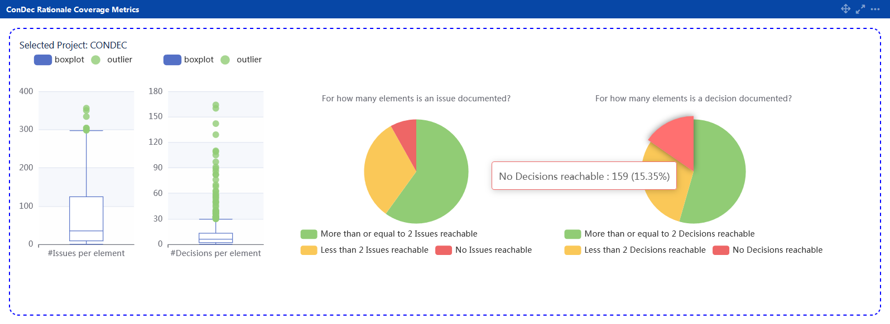
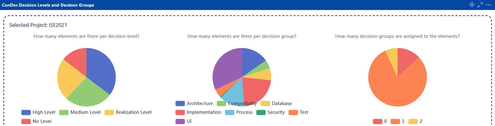
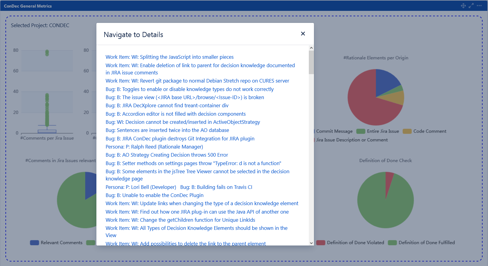

# Knowledge Dashboard

ConDec presents **metrics calculated on the knowledge graph data structure** in a knowledge dashboard.
The dashboard comprises five dashboard items that show the following metrics:

1. the **rationale coverage** of requirements and code, e.g., *how many decisions are documented for a requirement?*, 
2. **intra-rationale completeness**, e.g., *are there arguments for the decisions?*, 
3. **general metrics**, e.g., *how many rationale elements are documented per origin/documentation location?*, 
4. **metrics on the knowledge in git**, e.g., 
*do the rationale elements documented in [code comments and commit messages of a branch](knowledge-in-git-presentation.md) fulfill the [definition of done (DoD)](quality-checking.md)?*, and
5. **metrics on the decision levels and decision groups**, e.g. *Which decision groups are there in the project? How many decisions are documented per decision level and group?*

The metric plots are created using the [Apache ECharts library](https://echarts.apache.org).
The four dashboard items are shown in the following sections.

## Rationale Coverage
This dashboard item shows the **coverage of requirements, code, and other software artifacts (=knowledge elements) 
with a specific decision knowledge type, in particular, decision problem or decision**. 
For example, this dashboard item shows how many decisions are reachable from a requirement or 
how many decisions are reachable from a code file **within a certain link distance in the knowledge graph**.
Note that the rationale coverage is not calculated for rationale elements as source elements because there are 
dedicated metrics for intra-rationale completeness (see below).

*Rationale coverage dashboard item showing the **issue/decision problem coverage** and **decision coverage** using boxplots and pie charts*

## Intra-Rationale Completeness

This dashboard item presents **metrics regarding the intra-rationale completeness**.
In particular, metrics are shown to answer the following questions:
- How many **issues (=decision problems) are solved by a decision**? How many issues are not solved by a decision?
- For how many **decisions is the issue (=decision problem) documented**? For how many decisions is no issue documented?
- How many **decisions have at least one pro-argument** documented? How many decisions have no pro-arguments documented?
- How many **decisions have at least one con-argument** documented? How many decisions have no con-arguments documented?
- How many **alternatives have at least one pro-argument** documented? How many alternatives have no pro-arguments documented?
- How many **alternatives have at least one con-argument** documented? How many alternatives have no con-arguments documented?

*Intra-rationale completeness dashboard item showing the metrics using pie charts*

## General Metrics

This dashboard item presents the following **metrics on the knowledge graph data structure** after the graph was filtered with the given filter settings: 
- Number of comments per Jira issue
- Number of commits per Jira issue
- Number of code files and requirements in the project
- Number of rationale elements per origin/documentation location
- Number of comments with and without decision knowledge
- Number of decision knowledge elements per decision knowledge type
- Number of knowledge elements fulfilling and violating the definition of done (DoD)

*General metrics dashboard item showing metrics using boxplots and pie charts*

## Metrics about the Decision Knowledge in Git
This dashboard item presents decision knowledge-related and general metrics on the git branches of a Jira project.
Branches are represented as a [Diff] object.
In particular, the following metrics are shown:
- Quality status of git branches: *incorrect*, i.e. violates the DoD, *good*, i.e. fulfills the DoD, or *no rationale*, 
i.e. no rationale elements documented in [code comments and commit messages of a branch](knowledge-in-git-presentation.md).
- Quality problems in git branches to explain the DoD violations, e.g. *Issue does not have a valid decision*
- Number of issues/decision problems in code comments and commit messages of a branch
- Number of decisions in code comments and commit messages of a branch
- Number of alternatives in code comments and commit messages of a branch
- Number of pro-arguments in code comments and commit messages of a branch
- Number of con-arguments in code comments and commit messages of a branch
- Overview on Jira issues related to git branches

*Dashboard item showing metrics about the knowledge in git using boxplots and pie charts*

## Metrics about the Decision Levels and Decision Groups
This dashboard item presents an overview on the [decision levels and decision groups](decision-grouping.md) that the 
knowledge elements (in particular, the decision problems and solution options) documented within a project belong to.
The following metrics are shown:
- Number of knowledge elements per decision level
- Number of knowledge elements per decision group
- Number of decision groups assigned to the knowledge elements (=**decision group coverage**)

*Dashboard item showing metrics about the [decision levels and decision groups](decision-grouping.md)*

## Filtering
All dashboard items can be filtered and the filter settings are persisted for every dashboard item.
The filter settings are used to **filter the knowledge graph** similar to the [knowledge graph views](knowledge-visualization.md).
For example, the status filter specifies whether the decision problems should be *resolved* or *unresolved*. 
Per default, both resolved and unresolved decision problems (issues) are included.
Similarly, the filter settings can be used to specify that the coverage of decisions should only include decisions 
with status *decided* and no decisions with status *rejected* or *challenged*.

*Filter settings for rationale coverage dashboard item*

## Navigation
Developers can **navigate to the detail views of the knowledge elements or git branches** that are shown in the dashboard metric plots,
for example, to fix violations of the DoD.
The metric plots are interactive and the developers can **click on data points in the metrics plots**.
When clicking on a metric plot, ConDec presents a dialog with hyperlinks to the detail views of the respective knowledge elements or git branches.
The overall goal is to support [ubiquitous linking](https://linkingmanifesto.org).

*Navigation dialog with elements violating the DoD*

## Design Details
The following class diagram gives an overview of relevant backend classes for the dashboard.

*Overview class diagram for the dashboard*

The Java code for metric calculation and the dashboard creation can be found here:

- [Java code for the metric calculation](../../src/main/java/de/uhd/ifi/se/decision/management/jira/metric)
- [Java code for the dashboard creation](../../src/main/java/de/uhd/ifi/se/decision/management/jira/view/dashboard)
- [Java REST API for dashboard](../../src/main/java/de/uhd/ifi/se/decision/management/jira/rest/DashboardRest.java)

The UI code for the dashboard can be found here:

- [Velocity templates for the dashboard](../../src/main/resources/templates/dashboard)
- [JavaScript code for the dashboard](../../src/main/resources/js/dashboard)

[Diff]: ../../src/main/java/de/uhd/ifi/se/decision/management/jira/git/model