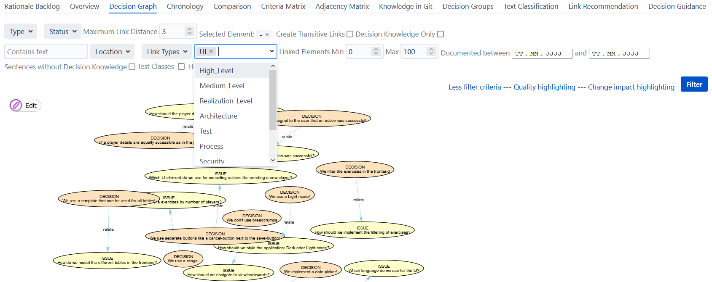

# Decision Grouping

The ConDec Jira plugin enables to **group decisions and related knowledge elements**.
Developers can group decisions according to predefined **levels (high, medium, and realization)**.
They can also define **custom groups (e.g. UI, process, design, requirements, architecture, testing, ...)**.

Major differences between ConDec's decision grouping and the Jira label mechanism are:
- Decision knowledge elements (in particular, decision problems and solution options) from **[various documentation locations](documentation.md)** 
(e.g. documented in comments and commit messages) can be gathered in decision groups.
For example, developers can access a UI decision documented in code from a [knowledge graph view](knowledge-visualization.md) in Jira through decision group filtering.
- The **group assignment is inherited** within the decision knowledge. 
For example, if a developer assigns a decision to the decision group *process*, the linked decision problem and alternatives will inherit this group.

We use the following definition for decision levels by [van der Ven and Bosch (2013)](https://doi.org/10.1007/978-3-642-39031-9_15):
1. *High level decisions* affect the whole product, altough they are not necessarily always the decisions that are debated 
or thought through the most. 
Often, people that are not involved in the realization of the project (e.g. management or enterprise architects) heavily affect these decisions. 
Typical examples of high-level decisions are the choice to adopt an architectural style, 
use a programming language, application server, or specific large (COTS) components.
Changing these decisions typically has a huge impact.
2. *Medium level decisions* involve the selection of specific components or frameworks, 
or describe how specific components map to each other according to specific architectural patterns. 
These decisions are often debated in the architecture and development teams and are evaluated, changed and discarded as needed. 
They have a high impact on the (nonfunctional) properties of the product and are relatively expensive to change.
3. *Realization level decisions* involve the structure of the code, the location of specific responsibilities (e.g. design patterns), 
or the usage of specific APIs. 
These decisions are relatively easy to change, and have relative low impact on the properties of the system.

## Assignment and Filtering
Levels and custom groups can be assigned using the context menu on a specific knowledge element in a knowledge graph view.

*Context menu available in all [views on the knowledge graph](knowledge-visualization.md)*

*Dialog to assign a level and custom groups to a decision*

Developers (and other stakeholders) can **filter for decision levels and groups**, for example, if they only want to see decisions for the UI or process decisions.

*View elements of a specific decision group (here UI)*

## Decision Grouping as a Definition of Done Criterion
The rationale manager can enforce that developers assign decision problems and solution options to decision levels and groups by 
making the **assignment of decision levels and groups a [definition of done (DoD)](quality-checking.md) criterion**.
If a decision problem or solution option is not assigned to a decision level and decision, the quality check fails and 
the respective element is colored in red in the knowledge graph views as means of [nudging](nudging.md).
The **quality check view and the tooltip explain why the DoD is fulfilled or violated**.

*Decision problem that fullfills the DoD since a decision level (Medium) and decision group (UI) is assigned to it.*

*Decision problem that violates the DoD since no decision level and no custom decision group is assigned to it.
Developers can see an explanation for the DoD violation in the quality check view and in the tooltip.*

*Decision problem that violates the DoD since only a decision level but no custom decision group is assigned to it.*

## Decision Grouping Overview and Dashboard
ConDec offers an **overview for the decision levels and decision groups** assigned in a project.
In this overview, the developers can **rename and delete decision groups** via a context menu on group names.
They can also navigate to the details of the decisions and change the decision group/level assignment via a context menu on the decisions.

*Decision groups overview with context menu to rename or delete a group*

ConDec also offers a **[dashboard item for decision levels and decision groups](dashboard.md)**.

*[Dashboard](dashboard.md) item showing metrics about the decision levels and decision groups*

## Design Details
The following class diagram gives an overview of relevant backend classes for this feature.

*Overview class diagram for the decision grouping feature*

The Java code for decision grouping can be found here:

- [Java code for decision group persistence](../../src/main/java/de/uhd/ifi/se/decision/management/jira/persistence/DecisionGroupPersistenceManager.java)
- [Java REST API for decision grouping](../../src/main/java/de/uhd/ifi/se/decision/management/jira/rest/DecisionGroupingRest.java)

The UI code for decision grouping can be found here:

- [Velocity template for decision group overview](../../src/main/resources/templates/tabs/decisionGroups.vm)
- [JavaScript code for decision grouping](../../src/main/resources/js/grouping)

# Important Decisions
- SF: Group decisions ([CONDEC-692](https://jira-se.ifi.uni-heidelberg.de/browse/CONDEC-692))
	-  How can the rationale manager and the developers see which decision groups are used in the project and which decisions are assigned to the decision levels and decision groups?
		-  We create a dashboard item for decision levels and decision groups (using plot, in particular pie charts)!
			-  Pie charts give a good visual overview
		-  We create a separate decision grouping view that presents the decision levels/groups and the respective knowledge elements!
			-  Enables changing the group names and assigning elements
	-  Where do we enable the user to assign groups?
		-  We add a context menu entry to enable the user to group related elements!
	-  Which knowledge elements should inherit the assigned groups?
		-  All linked decision knowledge elements within a link distance of 3 inherit the group assignments!
			-  Maintains consistency for connected elements
			-  Subsequent elements can be part of groups that original issue is not part of
		-  We could do no inheritance between elements.
			-  Problems with displaying in a filtered view
			-  Loss of important relationships between the elements
			-  Easier to manage and implement
	-  Which definition of done criterion should ConDec have wrt. decision grouping?
		-  We could enable the rationale manager to configure how many decision groups need to be assigned.
		-  The definition of done (DoD) requires that at least a decision level and one decision group is assigned to every decision problem, decision, and alternative!
			-  Not configurable
			-  Quite strikt, but helps us to study which types of decisions developers document
	-  How do we access the decision groups/level for a knowledge element?
		-  We query the database table to access the decision groups/level for a knowledge element!
			-  We don't have to propagate changes (e.g. renamed groups) to the knowledge graph object.
			-  It seems not to be very efficient to query the database all the time.
		-  We could make decision groups/levels a "real" attribute of the KnowledgeElement class and only query it from database when the element is added to knowledge graph.
			-  We would have to propagate changes (e.g. renamed groups) to the knowledge graph object.
			-  Might be more efficient.

## References
The concept of decision levels is taken from: 
van der Ven, J. S., & Bosch, J. (2013). Making the Right Decision: Supporting Architects with Design Decision Data. 
In 7th European Conference on Software Architecture (ECSA'13) (Vol. 7957 LNCS, pp. 176-183). 
Montpellier, France: Springer. https://doi.org/10.1007/978-3-642-39031-9_15

Decision groups are e.g. used in:
van Heesch, U., Avgeriou, P., & Hilliard, R. (2012). A documentation framework for architecture decisions. 
Journal of Systems and Software, 85(4), 795-820. https://doi.org/10.1016/j.jss.2011.10.017