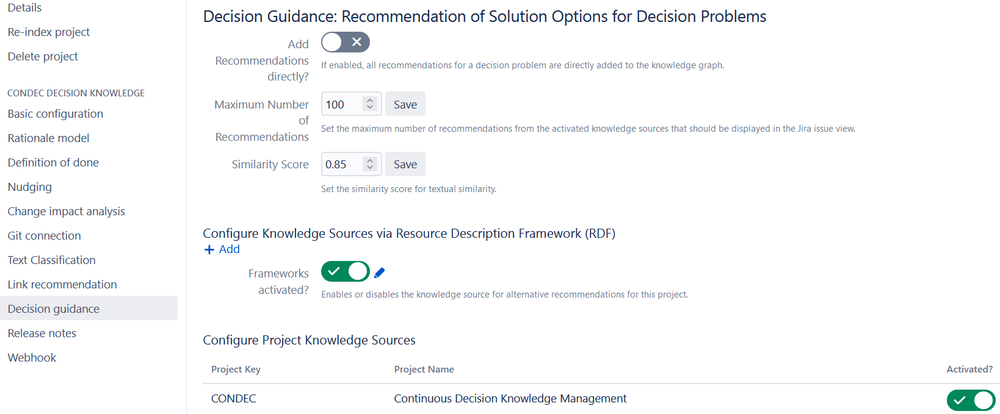

# Recommendation of Solution Options from External Knowledge Sources (Decision Guidance)

The ConDec Jira plug-in offers a feature that recommends solution options for decision problems from **external knowledge sources**.
Knowledge sources can be **other Jira projects** (ProjectSources) or RDFSources such as **DBPedia**. 
RDFSources are knowledge sources identified using the [Resource Description Framework (RDF)](https://en.wikipedia.org/wiki/Resource_Description_Framework) format.

The Figure below shows the **decision guidance view** with three recommendations generated from DBPedia 
for the decision problem *Which framework should we use as a webcrawler?*
The developers can **accept or discard** the recommendations.
If they accept a recommendation, the respective solution option and arguments are added to the knowledge graph.

*Decision guidance view with three recommendations generated from DBPedia*

## Recommendation Score
The **recommendation score** represents the predicted relevance of a recommendation, i.e., how likely the developers accept the recommendation.
The recommendation score is used to rank the recommendations.
The recommendation score consists of a value and an explanation. 
Besides, the recommendation score can be composed of various sub-scores for the criteria that were used to calculate the score.

*Explanation of the score for a recommendation generated from DBPedia*

## Evaluation
Software engineering researchers can judge the performance of the recommendations in the **evaluation view**.
The solution options documented for a selected decision problem are assumed to be the **ground truth/gold standard**.
The following evaluation metrics are calculated:

- **Number of True Positives:** Counts the number of true positives under the top-k results, 
i.e. the number of recommendations from a knowledge source that were already documented in the knowledge graph.
- **Precision@k:** Measures the precision (positive predictive value) within the top-k results, 
i.e. the fraction of relevant recommendations (that match the solution options in the ground truth) among the retrieved recommendations.
- **Recall@k:** Measures the recall (true positive rate/sensitivity) within the top-k results, 
i.e. the fraction of the solution options in the ground truth that are successfully recommended.
- **F-Score:** Measures the harmonic mean of Precision and Recall.
- **Average Precision:** Measures the average precision (AP) within the top-k results. 
Takes the total number of ground truth positives into account, i.e. the number of the solution options already documented.
- **Reciprokal Rank:** Measures the position of the first correct recommendation. 
For example: If the first recommendation is relevant, the reciprocal rank is 1. 
If the first recommendation is irrelevant and the second recommendation is relevant, the reciprocal rank is 0.5.

*Decision guidance evaluation view*

The evaluation view shows the total amount of recommendations generated from the knowledge source.
The recommendations for the decision problem *Which framework should we use as a webcrawler?* are
*Heritrix, Apache Nutch, Frontera (web crawling), SortSite, PowerMapper, HTTrack, Scrapy, Googlebot*.
Only the top-k recommendations (k=5 in the Figure) are used for the evaluation.

## Nudging Mechanisms
ConDec uses the following [nudging mechanisms](nudging.md) to support the usage of the decision guidance feature:

- **Ambient feedback:** The colored menu item indicate whether action is needed, i.e., 
whether there are recommendations that were not yet accepted or discarded by the developers.
- **Just-in-time prompt:** ConDec shows a [just-in-time prompt](../screenshots/nudging_prompt.png) to the developers when they change the state of a Jira issue.
Similar to the ambient feedback nudge, the just-in-time prompt indicates whether action is needed.

## Activation and Configuration
The decision guidance feature offers various configuration possibilities.
For example, the rationale manager can configure the RDFSources and ProjectSources that are used as external knowledge sources.

*Configuration view for decision guidance*

## Design Details
The following class diagram gives an overview of relevant backend classes for this feature.
The *DecisionGuidanceConfiguration* class stores the settings on a per-project basis. 
This configuration can be associated with 0 or more *KnowledgeSource*s. 
The *KnowledgeSource*s can either be sources configured using RDF or other Jira projects from the same server. 
The *KnowledgeSource* is used to generate *ElementRecommendation*s.
The class *ElementRecommendation* implements the *Recommendation* interface and inherits from *SolutionOption*. 
There can be *Argument*s attached to the solution options. 
The classes *SolutionOption* and *Argument* are concretizations of the *KnowledgeElement* class.
The *Evaluator* evaluates the *Recommendation*s using six different *EvaluationMetric*s (see metrics above).

*Overview class diagram for the decision guidance feature*

The Java code for decision guidance can be found here:

- [Java code for decision guidance](../../src/main/java/de/uhd/ifi/se/decision/management/jira/recommendation/decisionguidance)
- [Java REST API for decision guidance](../../src/main/java/de/uhd/ifi/se/decision/management/jira/rest/DecisionGuidanceRest.java)

The UI code for decision guidance can be found here:

- [Velocity templates for configuration and evaluation](../../src/main/resources/templates/settings/decisionguidance)
- [Velocity templates for usage during development](../../src/main/resources/templates/tabs/recommendation)
- [JavaScript code for decision guidance](../../src/main/resources/js/recommendation)

## Important Decisions
In the following, important decision knowledge regarding the decision guidance feature is listed.
The knowledge was exported via [ConDec's knowledge export feature](knowledge-export.md).

- SF: Discard recommended solution option ([CONDEC-997](https://jira-se.ifi.uni-heidelberg.de/browse/CONDEC-997))
	-  What information do we store for discarded recommendations from external knowledge sources?
		-  We could store the text contents and knowledge source ID for discarded recommendations.
			-  If the developer decides to discard a recommendation, we can expect him to have thought about this recommendation and decided that it does not fit for the given issue. Thus, it is unnecessary and even an annoyance to show the same recommendation (-text) again, just from another source
			-  If a recommendation from e.g. DBPedia without pro & con data is discarded, but later a recommendation with the same text from another project with pro & con data can be given, this might offer additional information
			-  Perhaps a recommendation is displayed twice from two different sources and one of them should be discarded to have a better overview
		-  Discard recommendations by text contents only, i.e. all recommendations with the same text are discarded no matter where they are from!
			-  The user might overlook additional data like pro & con arguments from a different source
			-  Saves the user the work of discarding a recommendation with the same contents multiple times if different sources yield the same recommendation
			-  Easier to solve