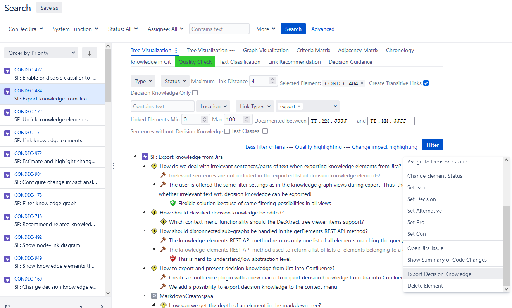
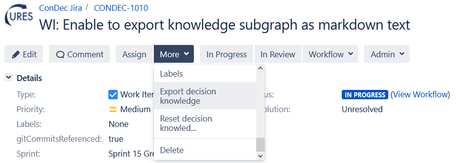
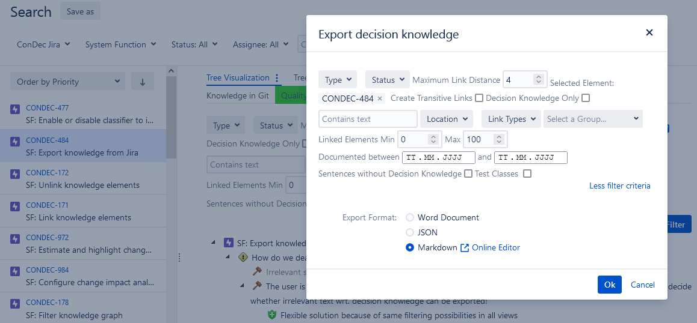

# Knowledge Export

ConDec enables to export decision knowledge and related knowledge elements, such as requirements, code, and work items.

*Context menu item to export the knowledge subgraph*

*Jira issue *More* menu item to export the knowledge subgraph*

*Dialog to export the knowledge subgraph. The user can filter the exported knowledge using the same filter settings 
as in the [knowledge graph views](knowledge-visualization.md).*

## Design Details

The Java code for knowledge export can be found here:

- [Java REST API for export of list of knowledge elements used for Word and JSON export](../../src/main/java/de/uhd/ifi/se/decision/management/jira/rest/KnowledgeRest.java)
- [Java REST API for markdown export](../../src/main/java/de/uhd/ifi/se/decision/management/jira/rest/ViewRest.java)

The UI code for knowledge export can be found here:

- [Velocity template for export dialog](../../src/main/resources/templates/dialogs/exportDialog.vm)
- [JavaScript code for knowledge export](../../src/main/resources/js/condec.export.js)

The following knowledge is exported via the knowledge export feature for the system function (SF) Export knowledge from Jira.
In particular, the following filter criteria were used for the export:

- selected element system function *SF: Export knowledge from Jira (CONDEC-484)*, which is a requirement for ConDec
- link distance 5 from the selected element
- [decision group](decision-grouping.md) *export*
- [transitive links](knowledge-visualization.md) should be established. 
For example, the code file *MarkdownCreator.java* is only indirectly linked to the system via a work item. 
The work item is not part of the *export* decision group, but the code file *MarkdownCreator.java* is part of the decision group.
The code file is included in the knowledge graph because of transitive linking.
The code file contains decision knowledge documented in its code comments.

- SF: Export knowledge from Jira ([CONDEC-484](https://jira-se.ifi.uni-heidelberg.de/browse/CONDEC-484))
	-  Which format do we support for exporting the knowledge documentation?
		-  CSV
		-  Use Word to export the decision knowledge documentation!
			-  Word files can be edited.
		-  PDF
			-  PDF files cannot be edited.
		-  Use Markdown format to enable the export of the knowledge subgraph!
			-  Markdown text can be imported into github release notes and .md files for feature documentation.
			-  Is also used for relase notes creation with explicit decision knowledge, thus, the code can be reused for general export.
	-  Which word files should be supported?
		-  Word Docs should be supported, as it was well documented!
	-  How do we deal with irrelevant sentences/parts of text when exporting knowledge elements from Jira?
		-  The user is offered the same filter settings as in the knowledge graph views during export! Thus, the user can decide whether irrelevant text wrt. decision knowledge can be exported!
			-  Flexible solution because of same filtering possibilities in all views
		-  rejected: Irrelevant sentences are not included in the exported list of decision knowledge elements!
	-  How should disconnected sub-graphs be handled in the getElements REST API method?
		-  rejected: The knowledge-elements REST API method used to return a list of lists of elements belonging to a connected graph!
			-  This is hard to understand/low abstraction level.
		-  The knowledge-elements REST API method returns only one list of all elements matching the query!
	-  How to export and present decision knowledge from Jira into Confluence? ([CONDEC-271](https://jira-se.ifi.uni-heidelberg.de/browse/CONDEC-271))
		-  Create a Confluence plugin with a new macro to import decision knowledge from Jira into Confluence! ([CONDEC-298](https://jira-se.ifi.uni-heidelberg.de/browse/CONDEC-298))
	-  We add a possibility to export decision knowledge to the context menu! ([CONDEC-480](https://jira-se.ifi.uni-heidelberg.de/browse/CONDEC-480))
	-  Which machine readable format should be implemented?
		-  JSON should be used as machine readable format to export the knowledge documentation! ([CONDEC-487](https://jira-se.ifi.uni-heidelberg.de/browse/CONDEC-487))
			-  web standard, easily parsable, many libraries that can handle the JSON format
		-  CSV
comma separated values
			-  hard to parse, not very flexible own parser has to be build, no data hierarchies
			-  Also readable by humans with excel
lightwight
		-  XML
Extensive markup language
			-  Created for document markup, not for data exchange
			-  Full Data hierarchies, old standard for Documents
	-  MarkdownCreator.java
		-  How can we include icon images into the markdown used for release notes and general knowledge export?
			-  We use the icon URL of github to include icon images into the markdown used for release notes and general knowledge export!
				-  The icons can be seen also by non Jira users. Thus, the markdown text could be excluded in external systems such as release page on github.
			-  We could the icon URL on the Jira server.
				-  The icons could not be seen by non Jira users.
		-  How can we get the depth of an element in the markdown tree?
			-  We use the BreadthFirstIterator::getDepth method to get the depth of an element!
				-  We build the markdown with a DepthFirstIterator which does not offer a method getDepth. We currently traverse the graph twice: first, with a breadth first and second, with a depth first iterator, which is not very efficient.
			-  We could use a shortest path algorithm (e.g. Dijkstra) to determine the link distance.
				-  Might also not be very efficient.