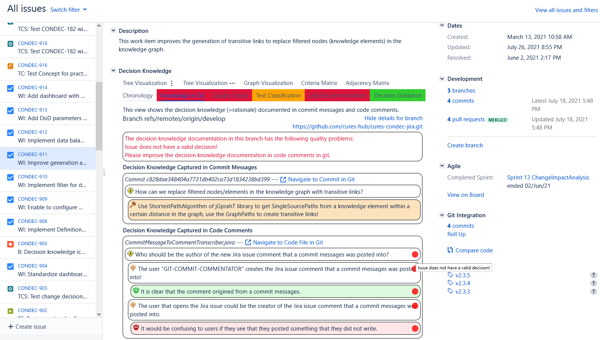
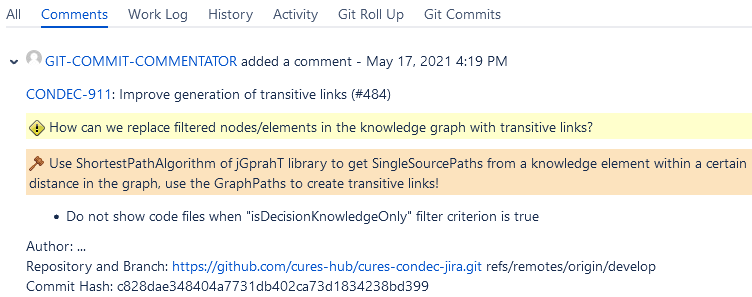

# Extraction and Presentation of Knowledge in Git

The ConDec Jira plug-in enables to explicitly [document decision knowledge in commit messages and code comments](documentation.md).
ConDec offers dedicated views for the knowledge in git.
It indicates quality problems in the decision knowledge documentation and uses [nudging mechanisms](nudging.md) 
to motivate the developers to improve the quality (e.g. coloring of menu items).



*View on knowledge from git for a specific Jira issue with highlighting of quality problems to nudge the developers to improve the quality*

To annotate decision knowledge directly in commit messages, the following syntax is used:
```
[issue] How can we replace filtered nodes/elements in the knowledge graph with transitive links? [/issue]
[decision] Use ShortestPathAlgorithm of jGprahT library to get SingleSourcePaths from a knowledge element within a 
 certain distance in the graph, use the GraphPaths to create transitive links! [/decision]
```
*Example of decision knowledge documented in a [commit message][commit]*

ConDec transcribes a commit message into a new comment of the Jira issue that was mentioned in the commit message.
Developers can annotate and evolve the decision knowledge documentation in the Jira issue comment.


*Example of a [commit message][commit] that was automatically posted/transcribed into a Jira issue comment*

In contrast, developers evolve the decision knowledge documentation in code comments directly within the code.
The following code snippet shows the improved decision in the code comment of the class [CommitMessageToCommentTranscriber]:

```java
/**
 * @issue Who should be the author of the new Jira issue comment that a commit messages was posted into?
 * @decision The user "GIT-COMMIT-COMMENTATOR" creates the Jira issue comment that a commit messages was posted into!
 * @pro It is clear that the comment origined from a commit messages.
 * @alternative The user that opens the Jira issue could be the creator of the Jira issue comment that a commit messages 
 *              was posted into.
 * @con It would be confusing to users if they see that they posted something that they did not write.
 * @alternative The git user could be the creator of the Jira issue comment that a commit messages was posted into.
 * @con Git user names can be different to Jira user names and it is hard to match them.
 */
private ApplicationUser getUser() {
```
*Example of decision knowledge documented in a code comment of the class [CommitMessageToCommentTranscriber]*

ConDec integrates code files as well as decision knowledge from commit messages and code comments into the knowledge graph.
Developers can filter the knowledge graph views, e.g. to only see the knowledge documented in git.


*Node-link tree diagram for the [CommitMessageToCommentTranscriber] class and decision knowledge documented in its code comments*

Trace link creation and maintenance between code files and Jira issues works as follows: 
1. Initial trace link creation during git clone. 
2. Manual link improvement and maintenance by developers. Developers can manually change links. 
3. Automatic trace link maintenance during git fetch based on recent changes.


*Node-link diagram for a code class and related knowledge elements*

Trace links between Jira issues and code can be wrong.
A reason for that can be that the commit linked to a Jira issue (via mentioning the key in the commit message) contains tangled, i.e. unrelated changes.
For example, a commit could be linked to a work item (WI, also called development task) for improving a certain feature.
This commit would be tangled if it also contains a bug fix for a totally different feature.
In our example, the class [CommitMessageToCommentTranscriber] could also con (here graph filtering through
Wrong trace links 


*Node-link diagram for a code class and related knowledge elements*

## Activation and Configuration
The extraction and presentation of knowledge from git offers various configuration possibilities.


*Configuration view for the extraction and presentation of knowledge from git*

## Design Details
The following class diagram gives an overview of relevant backend classes for this feature.


*Overview class diagram for the extraction and presentation of knowledge in git*

[CommitMessageToCommentTranscriber]: ../../src/main/java/de/uhd/ifi/se/decision/management/jira/git/CommitMessageToCommentTranscriber.java
[commit]: https://github.com/cures-hub/cures-condec-jira/commit/c828dae348404a7731db402ca73d1834238bd399