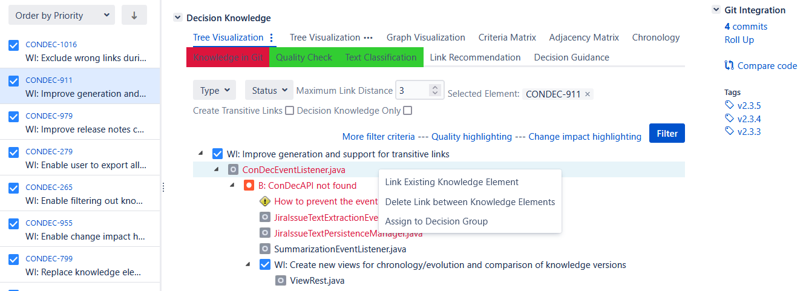
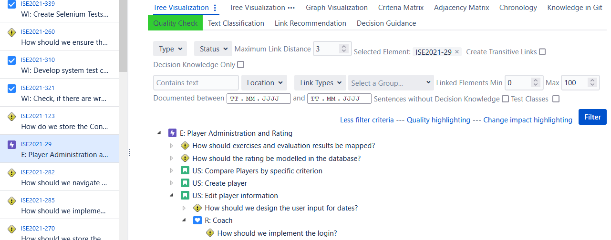
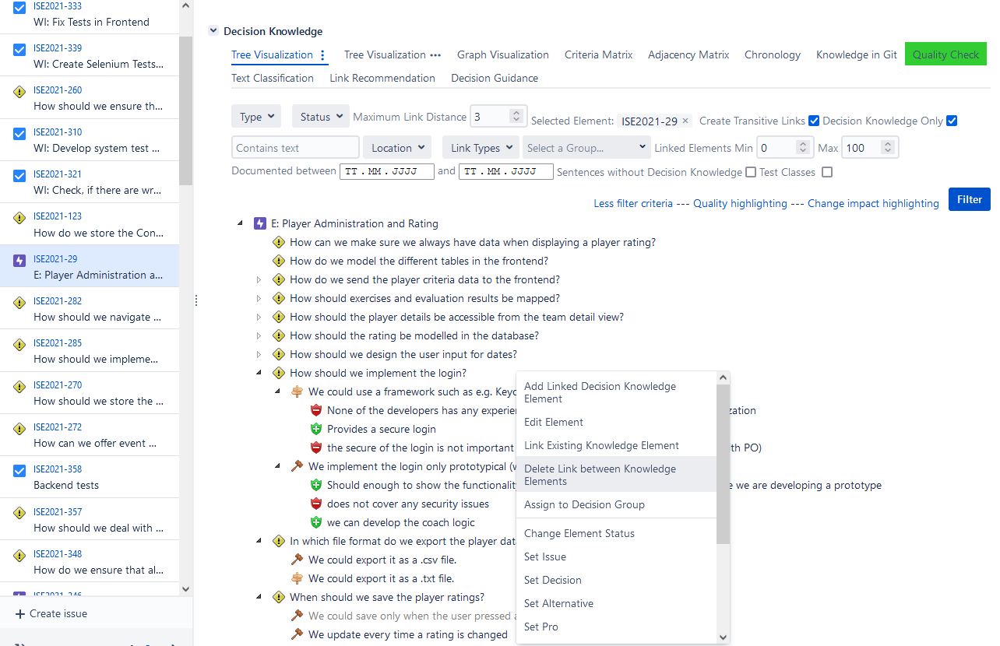
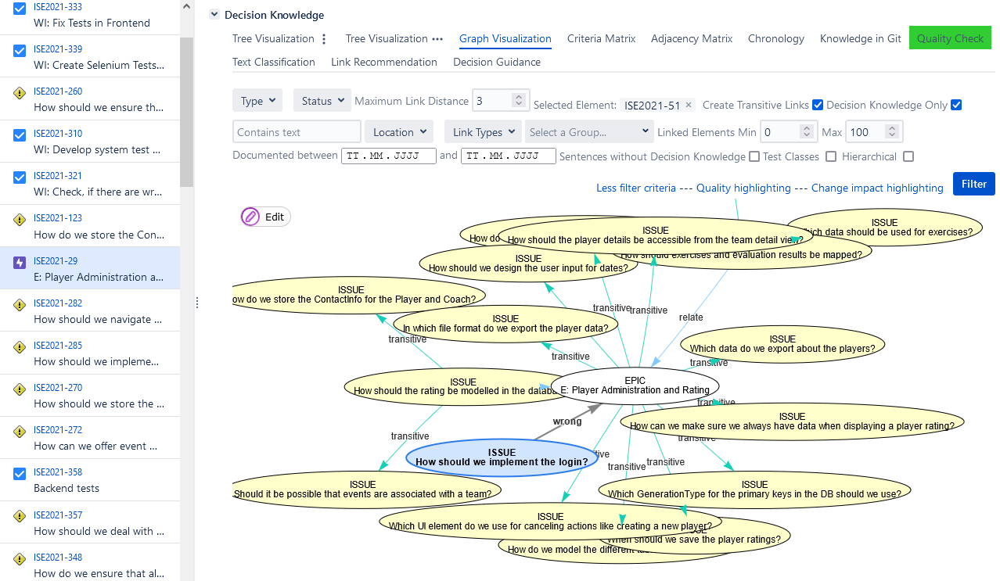

# Knowledge Management

To maintain a consistent knowledge graph, 
developers need to ensure that the knowledge elements and links are correctly documented. 
ConDec supports **manual linking between all knowledge elements** in the knowledge graph (i.e. software artifacts). 
Besides, ConDec offers techniques to **automatically link knowledge elements** within the knowledge graph, 
e.g., decisions to decision problems and [code to requirements via commits](knowledge-in-git-presentation.md). 
The [link recommendation](link-recommendation.md) feature recommends new links to the developers and detects duplicates.
Developers can **change and delete knowledge elements as well as links** between them, 
e.g., via a **context menu** and **Drag&Drop** in the knowledge graph views or via **changing the Jira issue text**. 

## Wrong Link Marking
Trace links between Jira issues and code can be wrong (see example 
in [Extraction and Presentation of Knowledge in Git](knowledge-in-git-presentation.md)).
**Wrong links hinder the exploitation** of the knowledge graph e.g. during [change impact analysis] or [transitive link creation].
ConDec enables developers to **manually mark links as wrong** as follows:
If a developer deletes a link that involves a code file, ConDec sets the type of the link to *wrong*.
Per default, wrong links are filtered-out, i.e. not shown in the [views on the knowledge graph](knowledge-visualization.md).
Besides, wrong links are not traversed during [transitive link creation] and [change impact analysis].

*Context menu that enables to delete a wrong link between a Jira issue and a code file introduced through a tangled commit.
(The class ConDecEventListener.java has nothing to do with transitive linking.)*

Wrong links can also be added to the knowledge graph to **improve knowledge exploitation**,
i.e. to **explicitly state that a link is not useful**.
In the following example, the epic *E: Player Administration and Rating* (requirement) is indirectly linked to the 
decision problem *How should we implement the login?* 
via the user story *US: Edit player information* and the user role *R: Coach*. 

*Indented outline showing knowledge elements directly and indirectly linked to the epic, i.e. reachable from the epic*

To understand the decisions related to the epic, developers can filter the knowledge graph view so that it only shows decision knowledge 
that is directly or indirectly (i.e. transitively) linked to the epic.
However, the developers rated the decision problem *How should we implement the login?* as not useful to understand the epic.
To exclude the link between the epic and the decision problem *How should we implement the login?*  from being visualized, 
the developers delete the transitive link.
ConDec sets the type of the link to *wrong*.

*Context menu that enables to delete a wrong transitive link between between an epic and a decision problem (issue)*

*Node-link diagram showing a wrong link between an epic and a decision problem (issue)*

## Design Details
ConDec uses both Jira issue links and custom links introduced by the plug-in.
For example, the custom links are used to link
a requirement and the decision knowledge elements in its comments, and
requirements and code files. 
The custom links are stored via object-relational mapping.

The following Java code implements the knowledge management:

- [Java code for data/model objects such as knowledge elements and links](../../src/main/java/de/uhd/ifi/se/decision/management/jira/model)
- [Java code for persistence of knowledge elements and links](../../src/main/java/de/uhd/ifi/se/decision/management/jira/persistence)
- [Java REST API for knowledge management](../../src/main/java/de/uhd/ifi/se/decision/management/jira/rest/KnowledgeRest.java)

The UI code involved in knowledge management can be found here:

- [Velocity template for the context menu](../../src/main/resources/templates/contextMenu.vm)
- [Velocity templates for the dialogs](../../src/main/resources/templates/dialogs)
- [JavaScript code for the context menu and dialogs](../../src/main/resources/js)

[transitive link creation]: knowledge-visualization.md
[change impact analysis]: change-impact-analysis.md