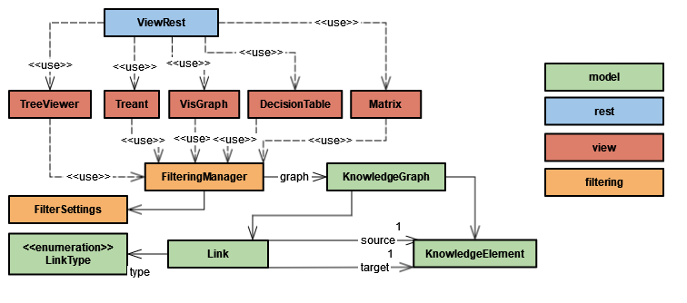
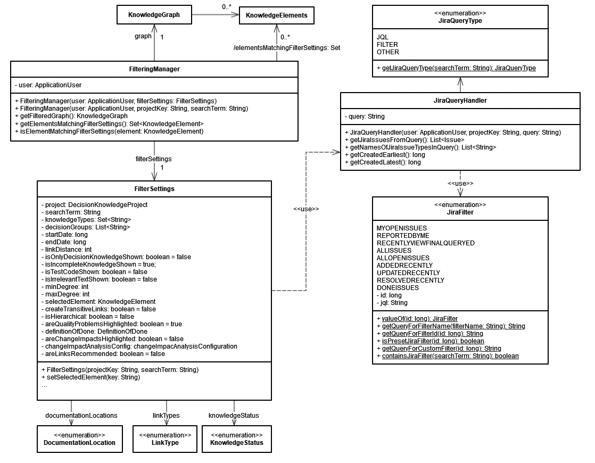

# Knowledge Visualization

Requirements engineers and developers use the integrated knowledge visualization 
to understand the requirements of a software system along with decisions related to 
their elicitation or implementation.
All the views use the same knowledge graph data structure underneath, which enables to easily add new views.

ConDec enables the developers to **exploit transitive links between knowledge elements**. 
For example, the developers developers can examine all decisions made in the context of a requirement. 
The decisions can be documented in work items, commit messages, and code files reachable from the requirement.

## Design Details
The following class diagrams give an overview of relevant backend classes for visualization and filtering of the knowledge graph.

*Overview of classes in view package*

The class *FilteringManager* is used to filter the knowledge graph. 
It provides two methods for filtering:
- *getElementsMatchingFilterSettings()* returns the KnowledgeElements matching the filter criteria as a list.
- *getSubgraphMatchingFilterSettings()* returns a subgraph matching the filter criteria as an *AsSubgraph* object.

The class *FilterSettings* contains the filter criteria. 
Filter criteria are:
- Selected knowledge element, e.g., currently selected work item.
- Types of knowledge elements, e.g., issue, decision, alternative, ...
- Status of the knowledge elements (*KnowledgeStatus*). e.g., unresolved issues
- Documentation location (*DocumentationLocation*)
- Time period for creation and modification of knowledge elements specified by *startDate* and *endDate*
- [Groups of decisions (e.g., which granularity medium level, high level, ...)](decision-grouping.md)
- Relation types (*LinkType*) in the knowledge graph
- Maximum linking distance (number of hops/length of path) from the initial node to the last node still included in the filtered subgraph
- Selection whether only decision knowledge and no other knowledge elements such as requirements or development tasks are to be displayed
- Selection whether test classes are to be displayed
- Minimum and maximum degree (=number of links/edges/relations) of a knowledge element (node)
- Selection whether incompletely documented knowledge elements are shown
- Selection, if transitive links should be generated
- [Selection, if nodes should be highlighted (by red text color), if they do not fulfill the Definition of Done](nudging.md)
- [Definition of Done to be satisfied for all nodes in the filtered subgraph](quality-checking.md)
- Selection of whether nodes should be highlighted (by red background color) if they are potentially affected by a change in the selected knowledge element (for [change impact analysis](change-impact-analysis.md))
- Change-impact-analysis configuration, which determines how change impacts are estimated
- Selection of whether [link recommendations](link-recommendation.md) should be displayed

*Filtering classes and associations (UML class diagram)*

## Publication
Kleebaum, A., Paech, B., Johanssen, J. O., & Bruegge, B. (2021). Continuous Rationale Visualization. 
In 2021 Working Conference on Software Visualization (VISSOFT) (pp. 33-43). 
Luxembourg: IEEE. https://doi.org/10.1109/VISSOFT52517.2021.00013