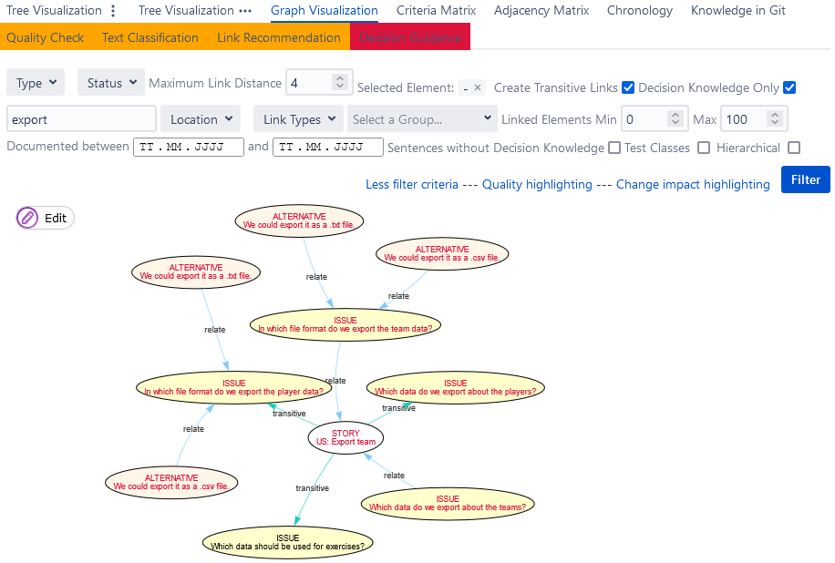

# Link Recommendation and Duplicate Recognition

The ConDec Jira plug-in offers a feature that **recommends new links between knowledge elements** and 
that tries to **identify duplicated knowledge elements**.
In particular, the feature should support developers in
1. avoiding duplicated decision making through **identifying related decision problems and solution options** documented by others or in the past,
2. detecting impacts, side, and ripple effects during changes in combination with **[change impact analysis (CIA)](change-impact-analysis.md)**, and 
3. general knowledge sharing.

## Calculation of the Recommendation Score

This feature tries to identify related knowledge elements using the **context information** of knowledge elements.
The context information is calculated from the following **context information providers, i.e. link recommendation rules**:

1. Recommend elements that are **textual similar** to the source element
2. Recommend elements that are **timely coupled** to the source element
3. Recommend elements that have the **same author** as the source element
4. Recommend elements that are **decision problems**
5. Recommend elements that are **solution options**
6. Recommend elements that are assigned to the **same decision group** as the source element
7. Recommend elements that are assigned to the **same component** as the source element
8. Recommend elements that can be **traced** to the source element
9. Recommend elements that are the same knowledge type as the source element.
10. Recommend elements that are included in the **same sprint**

Every context information provider calculates a <code>ruleValuei</code>.
For example, the textual similarity context information provider calculates a rule value based on the textual similarity of two knowledge elements. 
The more textual similar, the higher is the rule value for this context information provider.
Besides, every context information provider is assigned a <code>ruleWeighti</code> to determine its importance for recommendation creation.

For every knowledge element that might be related to the selected element, a `recommendationScore` is calculated as follows:

<code>recommendationScore = (&sum;N ruleValuei * ruleWeighti) / maxAchievableScore</code>

where `N` is the number of enabled context information providers 
and `maxAchievableScore` is the hypothetical best score to normalize the recommendation score between 0 and 1.

The <code>ruleWeighti</code> can also be negative to reverse the effect of the rule.
For instance, for the time context information provider (*recommend elements that are timely coupled to the source element*),
a negative rule weight means that elements that are not timely coupled are assigned a higher recommendation score.

The link recommendations are sorted by their `recommendationScore` to determine the best (top-k) recommendations.

A link to another knowledge element is only recommended if the `recommendationScore >= threshold` and 
if the link recommendation is under the **top-k recommendations**.

Many of the link recommendation rules (i.e. context information providers) are also used during **[CIA](change-impact-analysis.md)**
as **change propagation rules**.

## Duplicate Recognition
The textual similarity context information provider is used to **identify duplicates**.
If the text is very similar, a link recommendation is marked as a potential duplicate.

*Link recommendation view as part of the Jira issue view showing a potential duplicated alternative*

Developers and the rationale manager can inspect the potential duplicates in the [knowledge graph views](knowledge-visualization.md), 
e.g. in the [node-link diagram](../screenshots/link_recommendation_duplicates_node-link_diagram.png) or in the [indented outline](../screenshots/link_recommendation_duplicates_indented_outline.png).

*Node-link diagram showing the context of a user story.
Directly and transitively linked decision problems (issues) and solution options (alternatives) are shown that match the "export" filter string. 
The alternatives are duplicated.*

## Configuration
The rationale manager can configure the **default parameters** for the link recommendation, in particular, the
1. maximum number of recommendations (**top-k**), 
2. the **threshold**, and 
3. default ruleset (context information providers). The rationale manager can enable/disable each rule and can set a weight value (similar as for [CIA](change-impact-analysis.md)). 

Furthermore, the developer can change the default values during the usage of the link recommendation. 

*Configuration view for link recommendation and duplicate recognition*

## Design Details
The following class diagram gives an overview of relevant backend classes for this feature.
The class *LinkRecommendationRest* provides the interface to the frontend. 
It uses the *LinkRecommendationConfiguration* to get the configuration information for a project when a request comes. 
The interface *ContextInformationProvider* is implemented by five other classes: 
the class *ContextInformation* and four different *ContextInformationProvider*s that assess different types of context 
to find similarities between elements and ultimately suggest new links for elements. 
Each of these assigns a score based on the similarity or dissimilarity it has calculated. 
The *TextualSimilarityContextInformationProvider* assesses the textual similarity between two knowledge elements; 
the more textually similar the elements, the higher the score. 
Similarly, *TimeContextInformationProvider* assesses how close in time two elements were created. 
The score given here is higher if the elements were created in a shorter period of time and lower if they were created further apart. 
The *TracingContextInformationProvider* looks at how close in the knowledge graph two elements are to each other. 
If they have a lower link distance, the score is higher. 
Finally, the *UserContextInformationProvider* gives a positive score if the assignee or reporter of the issue 
where the first knowledge element is contained is the same as that of the second. 
If the users are not the same, the score is zero.
The class *ContextInformation* registers these four providers, and uses the information from them to create elements of the class *LinkRecommendation*.
*LinkRecommendation* elements each have a *RecommendationScore* and inherit from the class Link, 
which means they have source and target elements, as well as a *LinkType* (not shown in the diagram).

*Overview class diagram for the link recommendation feature*

The Java code for link recommendation can be found here:

- [Java code for link recommendation](../../src/main/java/de/uhd/ifi/se/decision/management/jira/recommendation/linkrecommendation)
- [Java REST API for link recommendation](../../src/main/java/de/uhd/ifi/se/decision/management/jira/rest/LinkRecommendationRest.java)

The UI code for link recommendation can be found here:

- [Velocity templates for configuration and evaluation](../../src/main/resources/templates/settings/linkrecommendation)
- [Velocity templates for usage during development](../../src/main/resources/templates/tabs/recommendation)
- [JavaScript code for link recommendation](../../src/main/resources/js/recommendation)

## References
The concept of context information providers is taken from: 
Miesbauer, C., & Weinreich, R. (2012). 
Capturing and Maintaining Architectural Knowledge Using Context Information. 
In 2012 Joint Working IEEE/IFIP Conference on Software Architecture and European Conference on Software Architecture (pp. 206–210). 
Helsinki, Finland: IEEE. 
https://doi.org/10.1109/WICSA-ECSA.212.30