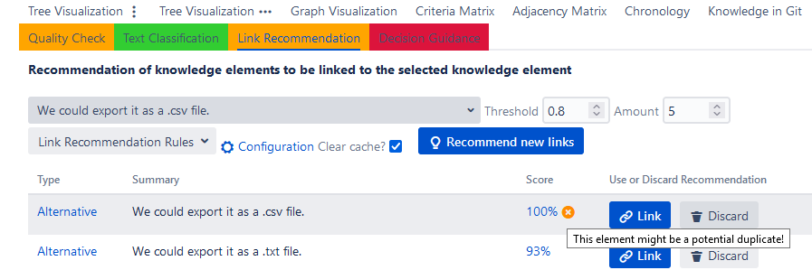
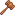

# Link Recommendation and Duplicate Detection

The ConDec Jira plug-in offers a feature that **recommends new links between knowledge elements** and 
that tries to **identify duplicated knowledge elements**.
In particular, the feature should support developers in
1. **decision making through identifying related decision problems and solution options** documented by others or in the past (to prevent duplicated decision making),
2. **creating a completely and correctly linked knowledge documentation** that can be exploited e.g. during **[change impact analysis]** (to detect impacts, side, and ripple effects of changes), and
3. general knowledge sharing and **knowledge exploitation**, since the link recommendation confronts the developers with related documented knowledge, which is not linked in the knowledge graph.

## Link Recommendations Within the Knowledge Graph Views
Developers see the link recommendations directly in the [knowledge graph views].
The respective nodes are highlighted and there is a dedicated *recommended* link type.
Developers can use the filter possibilities in [knowledge graph views] to inspect the context of the recommended elements.
Besides, the recommended elements can be included in [change impact analysis].

*Node-link diagram with link recommendations colored in blue and particular link type*

ConDec offers a dedicated view for link recommendation and duplicate detection which developers can access as follows:
1. Developers can access the link recommendation view from every Jira issue, i.e. it is included in the Jira issue view.
2. Developers can access the link recommendation view from ConDec's knowledge view for the project.

*Link recommendation view as part of ConDec's knowledge view showing link recommendations and a potential duplicate for a decision problem*

Developers can **accept (link) or discard** the recommendations.
The discarding can be undone.

## Calculation of the Recommendation Score
This feature tries to identify related knowledge elements using the **context information** of knowledge elements.
The context information is calculated from the following **context information providers, i.e. link recommendation rules**:

1. Recommend elements that are **textual similar** to the source element
2. Recommend elements that are **timely coupled** to the source element
3. Recommend elements that have the **same author** as the source element
4. Recommend elements that are **decision problems**
5. Recommend elements that are **solution options**
6. Recommend elements that are assigned to the **same [decision group](decision-grouping.md)** as the source element
7. Recommend elements that are assigned to the **same component** as the source element
8. Recommend elements that can be **traced** to the source element (but are not directly linked)
9. Recommend elements that are the same knowledge type as the source element
10. Recommend elements that are included in the **same sprint**

Every context information provider calculates a <code>ruleValuei</code>.
For example, the textual similarity context information provider calculates a rule value based on the textual similarity of two knowledge elements. 
The more similar the texts are, the higher is the rule value for this context information provider.
Besides, every context information provider is assigned a <code>ruleWeighti</code> to determine its importance for recommendation creation.

The <b><code>ruleWeighti</code> can be negative to reverse the effect</b> of the rule.
For instance, for the time context information provider (*recommend elements that are timely coupled to the source element*),
a negative rule weight means that elements that are not timely coupled are more likely to be recommended.

For every knowledge element that might be related to the selected element, a `recommendationScore` is calculated as follows:

<code>recommendationScore = (&sum;N(ruleValuei * ruleWeighti -&#12314;ruleWeighti < 0&#12315;ruleWeighti)) / maxAchievableScore</code>

where `N` is the number of enabled context information providers,
<code>-&#12314;ruleWeighti < 0&#12315;ruleWeighti</code> denotes that the subtraction is only done for negative rule weights to reverse the effect,
and `maxAchievableScore` is the hypothetical best score to normalize the recommendation score between 0 and 1.

The `recommendationScore` represents the predicted relevance of a recommendation, i.e., how likely the developers accept the recommendation.
The link recommendations are sorted by their `recommendationScore` to rank the recommendations.
The best (top-k) recommendations are determined.

A link to another knowledge element is only recommended if the `recommendationScore >= threshold` and 
if the link recommendation is under the **top-k recommendations**.

Many of the link recommendation rules (i.e. context information providers) are also used during **[change impact analysis]**
as **change propagation rules**.

Developers can see an **explanation for the score of each recommendation** (similar to the explanations during [change impact analysis] and [decision guidance]).

*Link recommendation view showing the explanation of one recommendation score and one discarded recommendation*

## Duplicate Recognition
The textual similarity context information provider is used to **identify duplicates**.
If the text is very similar, a link recommendation is marked as a potential duplicate.

*Link recommendation view as part of the Jira issue view showing a potential duplicated alternative*

Developers and the rationale manager can inspect the potential duplicates in the [knowledge graph views](knowledge-visualization.md), 
e.g. in the [node-link diagram](../screenshots/link_recommendation_duplicates_node_link_diagram.png) or in the [indented outline](../screenshots/link_recommendation_duplicates_indented_outline.png).

*Node-link diagram showing the context of a user story.
Directly and transitively linked decision problems (issues) and solution options (alternatives) are shown that match the "export" filter string. 
The alternatives are duplicated.*

## Nudging Mechanisms
ConDec uses the following **[nudging mechanisms](nudging.md)** to support the usage of the link recommendation and duplicate recognition feature:

- **Ambient feedback:** The colored menu item indicates whether action is needed, i.e., 
whether there are recommendations that were not yet accepted or discarded by the developers.
- **Just-in-time prompt:** ConDec shows a [just-in-time prompt](../screenshots/nudging_prompt.png) to the developers when they change the state of a Jira issue.
Similar to the ambient feedback nudge, the just-in-time prompt indicates whether action is needed.

## Configuration
The rationale manager can configure the **default parameters** for the link recommendation, in particular, the
1. maximum number of recommendations (**top-k**), 
2. the **threshold**, and 
3. **default rules (context information providers) and their weights** (similar as for [change impact analysis]). 

Furthermore, the developer can change the default values during the usage of the link recommendation. 

*Configuration view for link recommendation and duplicate recognition*

## Design Details
The following class diagram gives an overview of relevant backend classes for this feature.
The class *LinkRecommendationRest* provides the interface to the frontend. 
The class *LinkRecommendationConfiguration* stores the configuration information for a project. 
The class *ContextInformation* creates *LinkRecommendation*s and detects duplicates based on the context information of *KnowledgeElement*s.
It is decorated with the *ContextInformationProvider*s, such as the *TextualSimilarityContextInformationProvider* or *TimeContextInformationProvider*.
*LinkRecommendation*s have a *RecommendationScore* and inherit from the class *Link*, which means that they have source and target elements, as well as a *LinkType* (recommended).
The *RecommendationType* determines the type of the recommendation.

*Overview class diagram for the link recommendation and duplicate recognition feature*

The Java code for link recommendation and duplicate recognition can be found here:

- [Java code for link recommendation and duplicate recognition](../../src/main/java/de/uhd/ifi/se/decision/management/jira/recommendation/linkrecommendation)
- [Java REST API for link recommendation and duplicate recognition](../../src/main/java/de/uhd/ifi/se/decision/management/jira/rest/LinkRecommendationRest.java)

The UI code for link recommendation can be found here:

- [Velocity templates for configuration](../../src/main/resources/templates/settings/linkrecommendation)
- [Velocity templates for usage during development](../../src/main/resources/templates/tabs/recommendation)
- [JavaScript code for link recommendation and duplicate recognition](../../src/main/resources/js/recommendation)

[change impact analysis]: change-impact-analysis.md
[knowledge graph views]: knowledge-visualization.md
[decision guidance]: decision-guidance.md

# Important Decisions
In the following, important decision knowledge regarding the link recommendation and duplicate detection feature is listed.
The knowledge was exported via [ConDec's knowledge export feature](knowledge-export.md) starting from the 
system function *SF: Recommend related knowledge elements (elements to be linked and duplicates)*.

- SF: Recommend related knowledge elements (elements to be linked and duplicates) ([CONDEC-715](https://jira-se.ifi.uni-heidelberg.de/browse/CONDEC-715))
	-  Which elements should be suggested by the link recommendation feature?
		-  The link recommendation feature could only suggest decision knowledge elements, in particular decisions and decision problems.
		-  The link recommendation feature suggests any kind of knowledge elements (e.g. requirements, code files, decision knowledge, ...)!
			-  It is not efficient for large projects to iterate over all knowledge elements to generate link recommendations.
	-  TimeContextInformationProvider.java
		-  Which time interval should be used to decide whether two knowledge elements are timely coupled?
			-  We assume that two elements are timely coupled if they were both modified within a time interval of 1 day!
			-  We could enable the rationale manager to configure the interval for timely coupling.
	-  How to normalize and rank recommendations?
		-  rejected: We use a hypothetical recommendation to the same element as a benchmark for link recommendation and compare the recommendations to other knowledge elements with this recommendation!
			-  Does not work for rules such as that solution options and decision problems should be recommended, especially if the source element is not decision knowledge.
		-  We create the sum of absolute weight values to create a hypothetical best recommendation score!
	-  TextualSimilarityContextInformationProvider.java
		-  How can we measure the textual similarity of two texts?
			-  We could use vectorization of words using GloVE as for the automatic text classifier to measure the textual similarity of two texts.
			-  We tokenize the text, stem the tokens, and remove stop words! Then, we calculate a similarity score using Jaro-Winkler similarity and number of same tokens to measure the textual similarity of two texts!
	-  ContextInformationProvider.java
		-  Which link recommendation rules (context information providers) should be activated by default and with which weights?
			-  The default activation and default weight differ for every link recommendation rule! For example, the TextualSimilarityContextInformationProvider is activated per default with a weight value of 2 to increase its importance.
	-  LinkRecommendationRest.java
		-  How can we make sure that a new number of link recommendation rules in the backend is available to the users?
			-  We store all link recommendation rules if the number stored in the settings is different to them to fix inconsistency between stored config and new code!
	-  How do we support duplicate recognition within the knowledge documentation?
		-  ConDec suggests related knowledge elements to the user as part of the link recommendation feature!
		-  We remove the dedicated duplicate recognition functionality!
			-  Simplifies the plug-in
			-  The link recommendation can also return potential duplicates
	-  How can we determine whether two elements are potential duplicates?
		-  We mark a recommendation as a potential duplicate if two elements have a very high textual similarity!
	-  How should we deal with discarded recommendations?
		-  Enable to undo discarded recommendation!
		-  Add ambient feedback to link recommendation menu item, only use non-discarded recommendations to decide ambient feedback color!
		-  Include discarded recommendations in score calculation!
		
## References
The concept of context information providers is taken from: 
Miesbauer, C., & Weinreich, R. (2012). 
Capturing and Maintaining Architectural Knowledge Using Context Information. 
In 2012 Joint Working IEEE/IFIP Conference on Software Architecture and European Conference on Software Architecture (pp. 206-210). 
Helsinki, Finland: IEEE. 
https://doi.org/10.1109/WICSA-ECSA.212.30