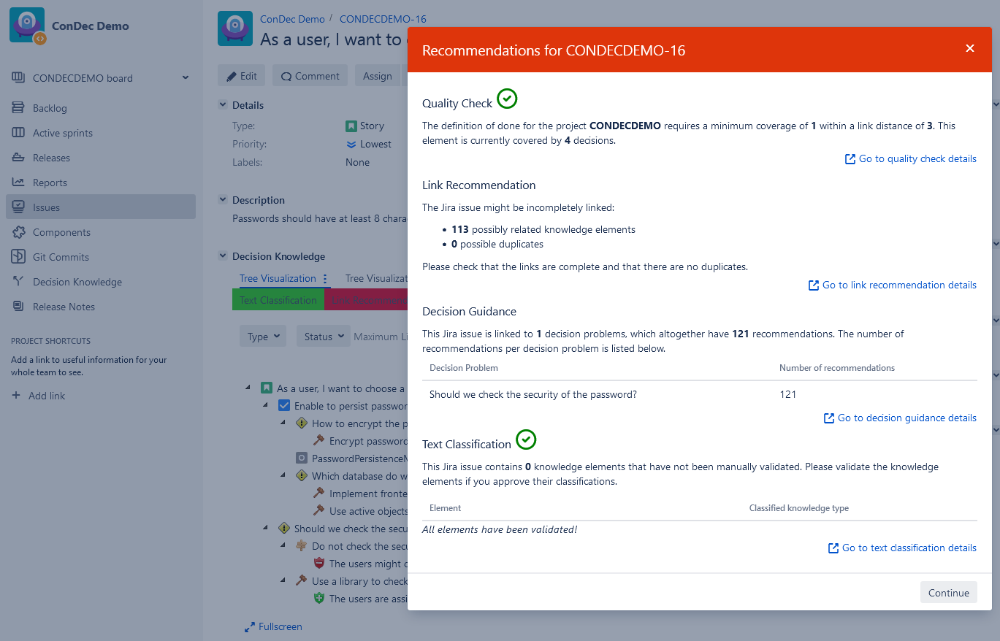

# Nudging Developers To Perform Rationale Management

The ConDec Jira plug-in tries to **motivate developers** to document decision knowledge and to use the documentation using nudging mechanisms.

## Just-in-time prompts
ConDec shows a **just-in-time prompt** to the developers when they change the state of a Jira issue, e.g., when they start or finish a requirement.
The just-in-time prompt covers recommendations regarding the following **smart features for rationale management**:
- [Definition of done checking to support high quality of the knowledge documentation](quality-checking.md)
- [Automatic text classification to identify decision knowledge in natural language text](automatic-text-classification.md)
- [Recommendation of solution options from external knowledge sources](decision-guidance.md)
- [Link recommendation and duplicate recognition](link-recommendation.md)

*Just-in-time prompt*

The rationale manager can activate or deactivate the events for that just-in-time prompts are shown. 
The events are activated per default for **opt-out nudging**.

*Configuration view for the events that trigger a just-in-time prompt*

## Ambient feedback and friction nudges
ConDec offers **ambient feedback nudging mechanisms** to indicate that there are recommendations regarding rationale management.

ConDec colors menu items according to the number of recommendations that have not been accepted or discarded by the developers:
If there are many recommendations, menu items are colored in red (i.e. action is needed by the developers, this can also be seen as a way to **create friction**).
If there are a few recommendations, menu items are colored in orange.
If there are no recommendations, e.g. if the [definition of done](quality-checking.md) is fulfilled 
or all recommendations were accepted or discarded by the developers, menu items are colored in green.

*Coloring of menu items to indicate whether action is needed*

Besides, the knowledge elements that violate the definition of done are highlighted with a red text color within
the knowledge graph views to indicate quality problems. 
Tooltips explain which definition of done criteria are violated.
This should nudge the developers to improve the quality.

*Overview of decision problems with quality highlighting*

## Design Details
The Java code for the nudging configuration can be found here:

- [Java classes for just-in-time prompt configuration](../../src/main/java/de/uhd/ifi/se/decision/management/jira/recommendation/prompts)
- [Java REST API for nudging](../../src/main/java/de/uhd/ifi/se/decision/management/jira/rest/NudgingRest.java)

The UI code for the knowledge export feature can be found here:

- [Velocity templates for just-in-time prompts](../../src/main/resources/templates/prompts)
- [Velocity template for configuration](../../src/main/resources/templates/settings/nudgingSettings.vm)
- [JavaScript code for nudging](../../src/main/resources/js/nudging)