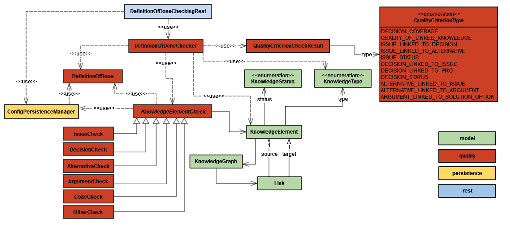

# Quality Checking

The ConDec Jira plugin offers the possibility to configure and check a **Definition of Done (DoD)** for the knowledge documentation.
The following **criteria of the DoD** are checked:
- the **decision coverage** (i.e. a type of rationale coverage) for every knowledge element
- criteria of the **intra-rationale completeness** for decision knowledge elements
- specific aspects (*is test file?*, *number of lines of code*) for code files
- the **quality of the directly linked knowledge elements** in the knowlegde graph, 
i.e. if a neighbor knowledge element of the checked element violates the DoD the checked element will also violate the DoD.
DoD violations are passed to neighbor elements in the knowlegde graph as a means of [nudging](nudging.md).

ConDec displays the result of the quality/DoD checking in the following ways:
- in a **quality check view** accessable from every knowledge element in the knowledge graph (see section below)
- using **[red text color](nudging.md) in knowledge graph views** if the DoD is violated. An explanation is given using a tooltip.
- in a **[just-in-time prompt](nudging.md)** that is shown during status changes (as automated quality checks integrated into the development workflow, e.g., when finishing a requirement)
- in the **[rationale backlog](rationale-backlog.md)**
- in a metric plot in the **[knowledge dashboard](dashboard.md)**
- in **[pull requests](https://github.com/cures-hub/cures-condec-bitbucket)** in the form of a **merge check**: 
For example, the developers can only accept a pull request if the decision coverage is high enough and 
if all the decision problems that are documented in a certain link distance from the changed code in the knowledge graph are solved.

## Quality Check View
The status of the quality check can be viewed continuously in the **quality check view**.
Developers can access the quality check view from the Jira issue view as well as from the rationale backlog and rationale overview.

The [color of the menu item](nudging.md) to access the quality check view is:
- green if all criteria of the DoD are fulfilled
- yellow if one or two criteria of the DoD are violated
- red if more than two criteria of the DoD are violated

The following screenshots show the quality check view for different selected knowledge elements.

*[Rationale backlog] showing the quality check results for the selected issue (=decision problem).
The issue violates the DoD criterion that at least one alternative need to be documented (this is a configurable criterion, see below).*

*[Rationale backlog] showing the quality check results for the selected issue. 
The issue fulfills the criteria of the DoD but the linked alternatives violate the DoD.*

*[Rationale backlog] showing the quality check results for the selected code file.
The code file violates the DoD criterion that at least 2 decisions need to be reachable in the knowledge graph within a link distance (number of hops) of 3.*

*Decision overview showing the quality check results for the selected decision.
Both the decision and the knowledge elements linked to the decision fulfill the DoD.*

*Alternative overview showing the quality check results for the selected alternative.
The alternative violates the DoD criterion that at least one argument needs to be documented.*

*Jira issue view showing the quality check results for the selected epic. 
Both the epic and the knowledge elements linked to the epic fulfill the DoD.*

*Code overview showing the quality check results for the selected code file.
The code file is not checked because it is a test code file (which can be configured by the rationale manager, see configuration below).
The knowledge elements directly linked to the code file fulfill the DoD.*

*Code overview showing the quality check results for the selected code file.
The code file is not checked because it is small with less than 50 lines of code (which can be configured by the rationale manager, see configuration below).
The knowledge elements directly linked to the code file fulfill the DoD.*

## Configuration
The rationale manager can configure the criteria for the DoD.

*Configuration view for the DoD for the knowledge documentation*

## Design Details
The following class diagram gives an overview of relevant backend classes for this feature.
The *DefinitionOfDone* stores the rules that are configured for the decision knowledge project’s rationale documentation to be considered complete. 
The *DefinitionOfDone* is configured separately for each *DecisionKnowledgeProject*, and is checked using the *DefinitionOfDoneChecker*. 
The *DefinitionOfDoneChecker* checks if the *DefinitionOfDone* is fulfilled for a *KnowledgeElement*. 
To do this, it uses the *KnowledgeType* of the element to fetch the corresponding inheritor of the abstract *KnowledgeElementCheck* class. 
An interface to the frontend is provided through the REST endpoints in the class *DefinitionOfDoneCheckingRest*.

*Overview class diagram for the quality checking feature*

The Java code for quality checking can be found here:

- [Java code for quality checking](../../src/main/java/de/uhd/ifi/se/decision/management/jira/quality)
- [Java REST API for quality checking](../../src/main/java/de/uhd/ifi/se/decision/management/jira/rest/DefinitionOfDoneCheckingRest.java)

The UI code for quality checking can be found here:

- [Velocity templates for configuration](../../src/main/resources/templates/settings/definitionofdone)
- [Velocity template for quality checking](../../src/main/resources/templates/tabs/qualityCheck.vm)
- [JavaScript code for quality checking](../../src/main/resources/js/definitionofdone)

[Rationale backlog]: ../../src/main/java/de/uhd/ifi/se/decision/management/jira/git/model