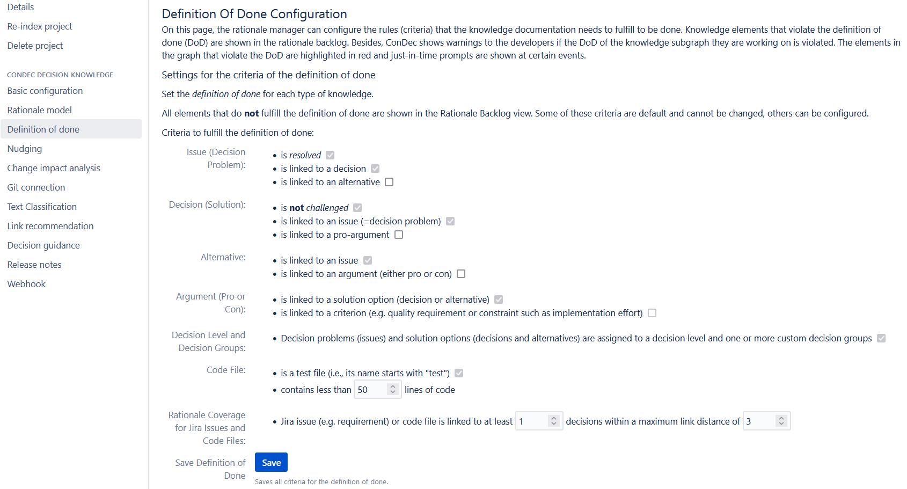

# Quality Checking

The ConDec Jira plugin offers the possibility to configure a **Definition of Done (DoD)** for decision knowledge.
The definition of done is checked and the status of the quality can be viewed continuously in the Quality Check tab.

ConDec supports the fulfillment of the definition of done with the help of a [knowledge dashboard](dashboard.md) and automated quality checks integrated into the development workflow, e.g., when finishing a requirement. 
For example, the developer can only finish the log-in requirement if all the decision problems that are documented in a certain link distance in the knowledge graph are solved.

The result of the quality checking is displayed in the following ways:
- in a quality checking view accessable from every knowledge element in the knowledge graph
- using [red text color](nudging.md) in knowledge graph views if the DoD is violated. An explanation is given using a tooltip.
- in a [just-in-time prompt](nudging.md) that is shown during status changes
- in the [rationale backlog](rationale-backlog.md)
- in a metric plot in the [knowledge dashboard](dashboard.md)

## Configuration
The rationale manager can configure the criteria for the DoD.

*Configuration view for the DoD for the knowledge documentation*

## Design Details
The following class diagram gives an overview of relevant backend classes for this feature.
The *DefinitionOfDone* stores the rules that are configured for the decision knowledge project’s rationale documentation to be considered complete. 
The *DefinitionOfDone* is configured separately for each *DecisionKnowledgeProject*, and is checked using the *DefinitionOfDoneChecker*. 
The *DefinitionOfDoneChecker* checks if the *DefinitionOfDone* is fulfilled for a *KnowledgeElement*. 
To do this, it uses the *KnowledgeType* of the element to fetch the corresponding inheritor of the abstract *KnowledgeElementCheck* class. 
An interface to the frontend is provided through the REST endpoints in the class *DefinitionOfDoneCheckingRest*.

*Overview class diagram for the quality checking feature*

The Java code for quality checking can be found here:

- [Java code for quality checking](../../src/main/java/de/uhd/ifi/se/decision/management/jira/quality)
- [Java REST API for quality checking](../../src/main/java/de/uhd/ifi/se/decision/management/jira/rest/DefinitionOfDoneCheckingRest.java)

The UI code for quality checking can be found here:

- [Velocity templates for configuration](../../src/main/resources/templates/settings/definitionofdone)
- [Velocity template for quality checking](../../src/main/resources/templates/tabs/qualityCheck.vm)
- [JavaScript code for quality checking](../../src/main/resources/js/definitionofdone)