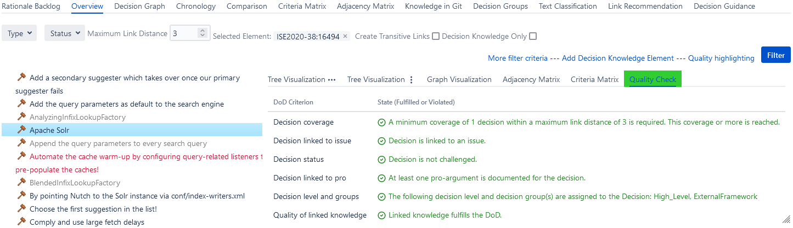

# Quality Checking

The ConDec Jira plugin offers the possibility to configure a **Definition of Done (DoD)** for decision knowledge.
The definition of done is checked.

ConDec supports the fulfillment of the definition of done with the help of a [knowledge dashboard](dashboard.md) and automated quality checks integrated into the development workflow, e.g., when finishing a requirement. 
For example, the developer can only finish the log-in requirement if all the decision problems that are documented in a certain link distance in the knowledge graph are solved.

The result of the quality checking is displayed in the following ways:
- in a quality checking view accessable from every knowledge element in the knowledge graph
- using [red text color](nudging.md) in knowledge graph views if the DoD is violated. An explanation is given using a tooltip.
- in a [just-in-time prompt](nudging.md) that is shown during status changes
- in the [rationale backlog](rationale-backlog.md)
- in a metric plot in the [knowledge dashboard](dashboard.md)

The following **criteria of the DoD** are checked:
- the **decision coverage** (i.e. a type of rationale coverage) for every knowledge element
- criteria of the **intra-rationale completeness** for decision knowledge elements
- specific aspects (is test file?, number of lines of code) for code files
- the **quality of the directly linked knowledge elements** in the knowlegde graph, 
i.e. if a neighbor knowledge element of the checked element violates the DoD the checked element is also colored in red.
DoD violations are passed to neighbor elements in the knowlegde graph as a means of [nudging](nudging.md).

## Quality Check View

The status of the quality can be viewed continuously in the **Quality Check** view.
Developers can access the Quality Check view from the Jira issue view and from the rationale backlog and overview.

The [color of the menu item](nudging.md) to access the quality check view is:
- green if all criteria of the DoD are fulfilled
- yellow one or two criteria of the DoD are violated
- red if more than two criteria of the DoD are violated

*Rationale backlog showing the quality check results for the selected issue*

*Decision overview showing the quality check results for the selected decision*

*Alternative overview showing the quality check results for the selected alternative*

## Configuration
The rationale manager can configure the criteria for the DoD.

*Configuration view for the DoD for the knowledge documentation*

## Design Details
The following class diagram gives an overview of relevant backend classes for this feature.
The *DefinitionOfDone* stores the rules that are configured for the decision knowledge project’s rationale documentation to be considered complete. 
The *DefinitionOfDone* is configured separately for each *DecisionKnowledgeProject*, and is checked using the *DefinitionOfDoneChecker*. 
The *DefinitionOfDoneChecker* checks if the *DefinitionOfDone* is fulfilled for a *KnowledgeElement*. 
To do this, it uses the *KnowledgeType* of the element to fetch the corresponding inheritor of the abstract *KnowledgeElementCheck* class. 
An interface to the frontend is provided through the REST endpoints in the class *DefinitionOfDoneCheckingRest*.

*Overview class diagram for the quality checking feature*

The Java code for quality checking can be found here:

- [Java code for quality checking](../../src/main/java/de/uhd/ifi/se/decision/management/jira/quality)
- [Java REST API for quality checking](../../src/main/java/de/uhd/ifi/se/decision/management/jira/rest/DefinitionOfDoneCheckingRest.java)

The UI code for quality checking can be found here:

- [Velocity templates for configuration](../../src/main/resources/templates/settings/definitionofdone)
- [Velocity template for quality checking](../../src/main/resources/templates/tabs/qualityCheck.vm)
- [JavaScript code for quality checking](../../src/main/resources/js/definitionofdone)