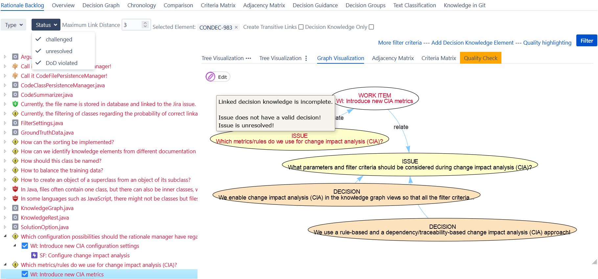

# Rationale Backlog

ConDec offers a **rationale backlog** with preset filter criteria so that only knowledge elements that [violate the definition of done (DoD)](quality-checking.md) are shown.
The rationale backlog supports **decision knowledge sharing** and **collaborative decision making**.
In particular, the rationale backlog shows **open decision problems** for which a decision still needs to be made (or documented), **challenged decisions**, 
and all **knowledge elements that violate the DoD** in any other criterion.

*Rationale backlog that lists knowledge elements violating the DoD on the left side. 
The right side shows the context of a work item in the node link diagram, which is a specific knowledge graph view.*

*Rationale backlog that lists knowledge elements violating the DoD on the left side. 
The right side shows the context of a work item in the node-link tree diagram, which is a specific knowledge graph view.*

## Design Details
There are no dedicated Java classes for the rationale backlog because the rationale backlog comprises the [knowledge graph views](knowledge-visualization.md) with special filtering.
The UI code for the rationale backlog can be found here:

- [Velocity template for the rationale backlog](../../src/main/resources/templates/tabs/rationaleBacklog.vm)
- [JavaScript code for the rationale backlog](../../src/main/resources/js/condec.rationale.backlog.js)