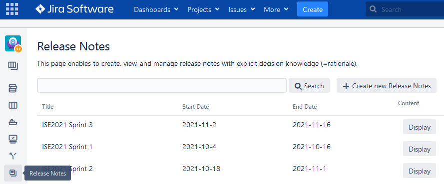
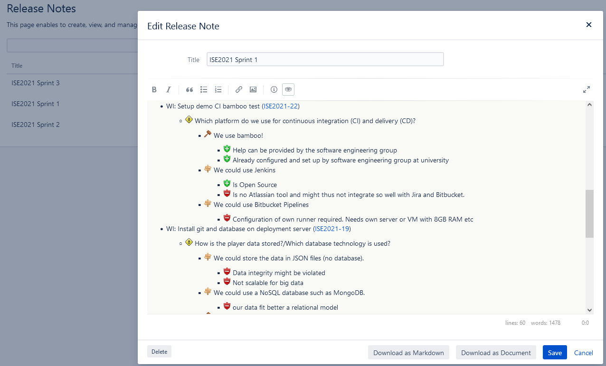
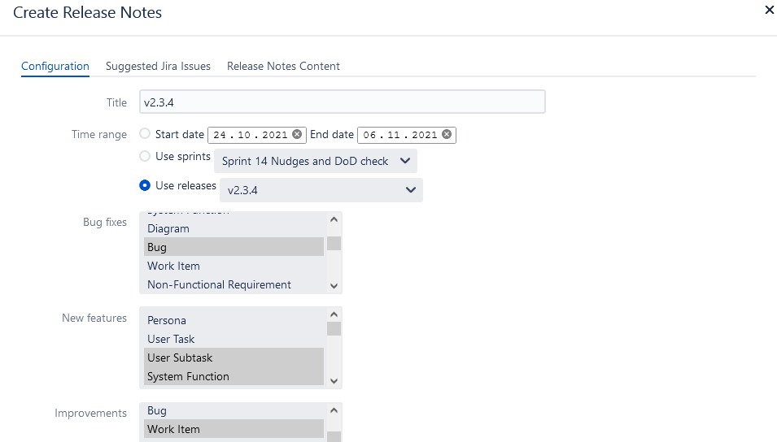
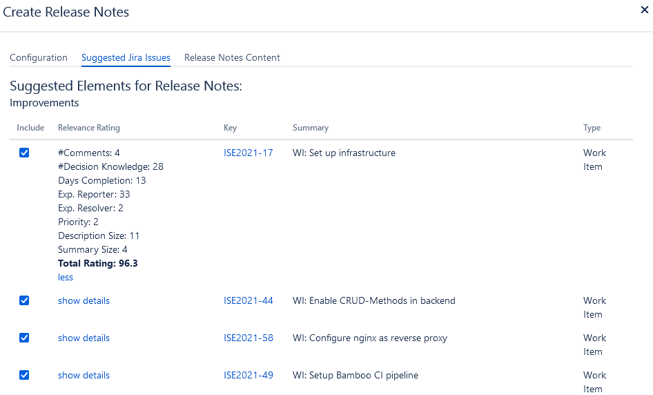
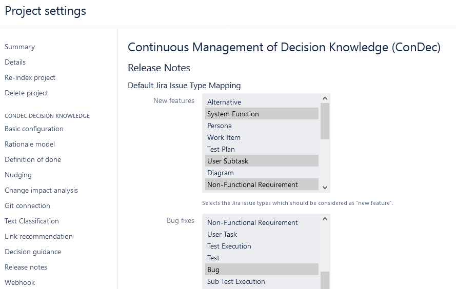
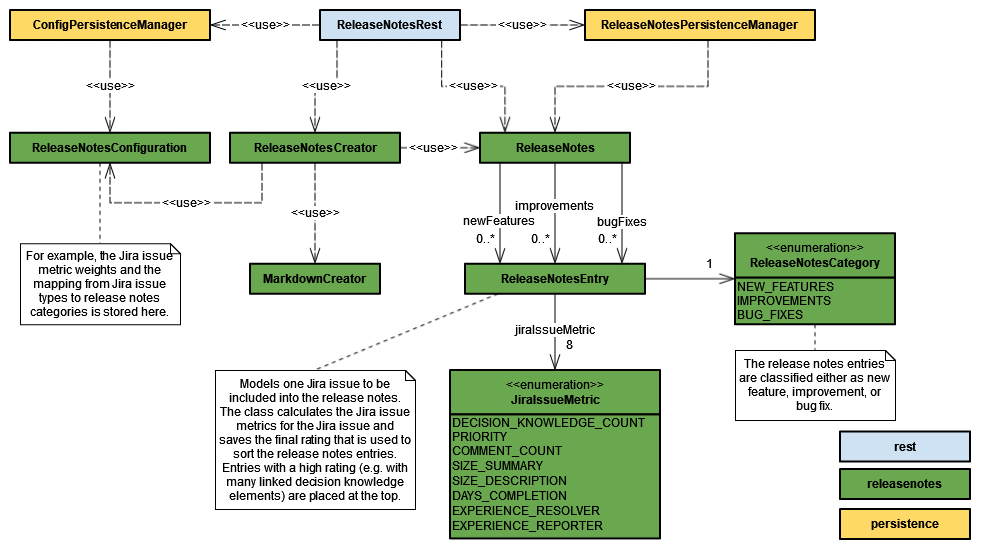

# Release Notes Creation

The ConDec Jira plugin enables to create release notes including explicit rationale (=decision knowledge).
See the [release notes of the ConDec Jira plugin](https://github.com/cures-hub/cures-condec-jira/releases) as an example.

The plugin offers a view for release notes creation and management.

*Release notes view for a project*

Developers and other stakeholders can view and export the release notes there.

*View existing release notes*

The **release notes creator** creates new release notes by choosing a time range (either manually or by selecting a sprint or release).
The Jira issues that were resolved during the time range are classified into three release notes categories:
- New features
- Improvements
- Bug fixes

The release notes creator can set the mapping between Jira issue type and release notes category during the creation of a single release notes.

*Dialog to create new release notes*

For every Jira issue, a rating is calculated from the following metrics:
- number of decision knowledge elements reachable from the Jira issue (with a number of hops/link distance of 3)
- priority (e.g., low, medium, high)
- number of comments of the Jira issue
- length of summary and description text (number of words)
- number of days that the Jira issue was open
- number of resolved Jira issues by the assignee user
- number of reported Jira issues by the reporter user

The rating is used to sort the release notes entries: entries with the highest rating are placed at the top.
For every metric, the metric value (e.g. number of comments) is multipled with a weight.
The rating is calculated as the sum of all metrics.
The release notes creator can set the weights during the creation of a single release notes.

The plugin shows the rating for every Jira issue in a tooltip.

*Rated Jira issues to be included into the new release notes*

Finally, the plugin creates the release notes content including the decision knowledge elements linked to the Jira issues.
The release notes content is written in a markdown language so that it can be imported into other systems.

## Configuration
The rationale manager can set default parameters for the release notes creation.

*Configuration view for the release notes creation*

Besides, the release notes creator can change the default values during the creation of a single release notes.

## Design Details
The following class diagram gives an overview of relevant backend classes for this feature.

*Overview class diagram for the release notes creation feature*